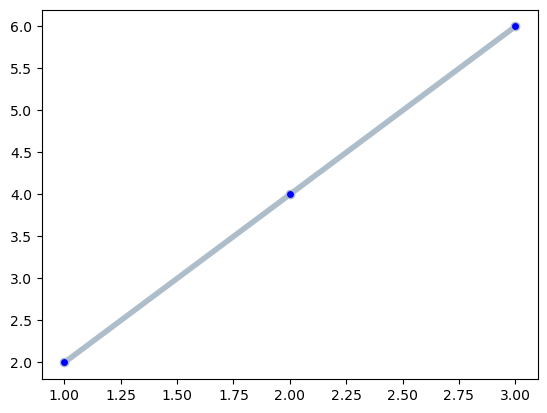
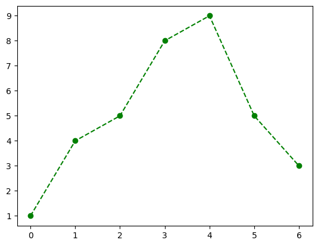
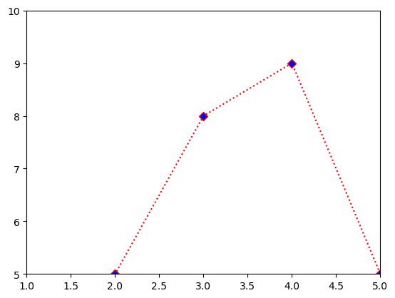
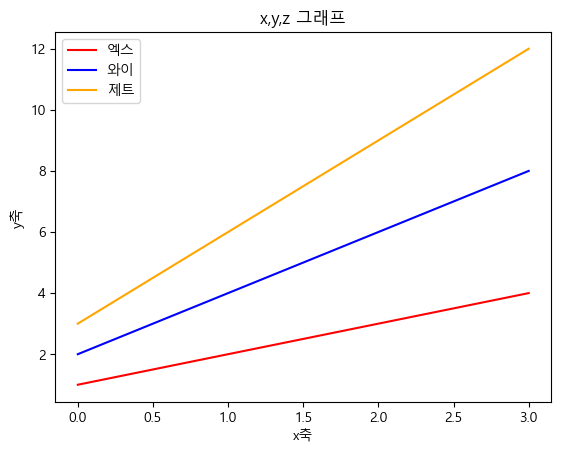

```python
import matplotlib.pyplot as plt
```


```python
y=[2,4,6]

# plot 함수 : 일직선으로 되어있는 Lineplot 그리기
plt.plot(y) # 그래프 그리기
plt.show() # 그래프 출력
```


    

    


```python
x=[1,2,3]
y=[2,4,6]

plt.plot(x,y) # 그래프 그리기
plt.show() # 그래프 출력
```


    

    


```python
# line style (=ls)
# 그려지는 선의 스타일을 지정하는 속성

plt.plot(x,y,ls="--")
plt.show()
```


    

    


```python
# marker

plt.plot(x,y,marker="o")
plt.show()
```


    

    


```python
# line width, 선의 두께

plt.plot(x,y,lw= 4)
plt.show()
```


    

    


```python
# line color, 선의 두께

plt.plot(x,y,color="#AEBDCA", lw=4, marker="o")
plt.show()
```


    

    


```python
# marker face color : mfc
# 마커의 색상 변경

plt.plot(x,y,color="#AEBDCA", lw=4, marker="o", mfc="b")
plt.show()
```


    

    


```python
import numpy as np
```


```python
x=np.arange(7)
y=[1,4,5,8,9,5,3]

plt.plot(x,y, ls="--", marker="o", color="g", mfc="g")
plt.show()
```


    

    


```python
x=np.arange(7)
y=[1,4,5,8,9,5,3]

plt.plot(x,y, ls=":", marker="D", color="r", mfc="b")
plt.show()
```


    

    


```python
# 범위 지정(=그래프의 영역 지정)
# xlim(최소,최대) : x축
# ylim(최소,최대) : y축

x=np.arange(7)
y=[1,4,5,8,9,5,3]

plt.plot(x,y, ls=":", marker="D", color="r", mfc="b")
plt.xlim(1,5)
plt.ylim(5,10)
plt.show()
```


    

    


```python
# tick 설정

plt.plot(x,y, ls=":", marker="D", color="r", mfc="b")
plt.xlim(-2,9)
plt.ylim(-1,10)
plt.xticks([0,3,6])
plt.yticks([1,5,6])
plt.show()
```


    

    


```python
# grid
# 틱의 위치를 잘 보기 위함

plt.plot(x,y, ls=":", marker="D", color="r", mfc="b")
plt.xlim(-2,9)
plt.ylim(-1,10)
plt.xticks([0,3,6])
plt.yticks([1,5,6])
plt.grid()
plt.show()
```


    

    


```python
# 여러 개의 그래프를 동시에 그리기
# plt.legend(loc=" ") : best가 기본값(default)
# 'best', 'upper right', 'upper left', 'lower left', 
# 'lower right', 'right', 'center left', 'center right'
# 'lower center', 'upper center', 'center'

x=[1,2,3,4]
y=[2,4,6,8]
z=[3,6,9,12]

plt.plot(x, color="r", label="x")
plt.plot(y, color="b", label="y")
plt.plot(z, color="orange", label="z")
plt.legend(loc="upper left")
plt.show()
```


    

    


```python
# 한글 지원 폰트로 바꾸기

from matplotlib import rc
rc("font",family="Malgun Gothic")
```


```python
# Label에 한글을 사용하고 싶으면 한글 지원 폰트를 사용해야함
# x축, y축 이름

plt.plot(x, color="r", label="엑스")
plt.plot(y, color="b", label="와이")
plt.plot(z, color="orange", label="제트")
plt.legend()
plt.xlabel("x축")
plt.ylabel("y축")
plt.title("x,y,z 그래프")
plt.show()
```


    

    


### 교통사고 데이터


```python
import pandas as pd
```


```python
# 데이터 업로드 : pandas에 있는 함수 - read_csv

data=pd.read_csv("Traffic_Accident_2017.csv",encoding="euc-kr")
```


```python
data
```


<div>
<style scoped>
    .dataframe tbody tr th:only-of-type {
        vertical-align: middle;
    }

    .dataframe tbody tr th {
        vertical-align: top;
    }

    .dataframe thead th {
        text-align: right;
    }
</style>
<table border="1" class="dataframe">
  <thead>
    <tr style="text-align: right;">
      <th></th>
      <th>발생년</th>
      <th>발생년월일시</th>
      <th>발생분</th>
      <th>주야</th>
      <th>요일</th>
      <th>사망자수</th>
      <th>사상자수</th>
      <th>중상자수</th>
      <th>경상자수</th>
      <th>부상신고자수</th>
      <th>...</th>
      <th>도로형태_대분류</th>
      <th>도로형태</th>
      <th>당사자종별_1당_대분류</th>
      <th>당사자종별_1당</th>
      <th>당사자종별_2당_대분류</th>
      <th>당사자종별_2당</th>
      <th>발생위치X_UTMK</th>
      <th>발생위치Y_UTMK</th>
      <th>경도</th>
      <th>위도</th>
    </tr>
  </thead>
  <tbody>
    <tr>
      <th>0</th>
      <td>2017</td>
      <td>2017010101</td>
      <td>15</td>
      <td>야간</td>
      <td>일</td>
      <td>1</td>
      <td>2</td>
      <td>1</td>
      <td>0</td>
      <td>0</td>
      <td>...</td>
      <td>단일로</td>
      <td>기타단일로</td>
      <td>승용차</td>
      <td>승용차</td>
      <td>승용차</td>
      <td>승용차</td>
      <td>933501</td>
      <td>1700129</td>
      <td>126.768634</td>
      <td>35.294464</td>
    </tr>
    <tr>
      <th>1</th>
      <td>2017</td>
      <td>2017010102</td>
      <td>28</td>
      <td>야간</td>
      <td>일</td>
      <td>1</td>
      <td>1</td>
      <td>0</td>
      <td>0</td>
      <td>0</td>
      <td>...</td>
      <td>교차로</td>
      <td>교차로부근</td>
      <td>승용차</td>
      <td>승용차</td>
      <td>보행자</td>
      <td>보행자</td>
      <td>967570</td>
      <td>1944453</td>
      <td>127.133107</td>
      <td>37.498741</td>
    </tr>
    <tr>
      <th>2</th>
      <td>2017</td>
      <td>2017010102</td>
      <td>43</td>
      <td>야간</td>
      <td>일</td>
      <td>1</td>
      <td>2</td>
      <td>0</td>
      <td>1</td>
      <td>0</td>
      <td>...</td>
      <td>단일로</td>
      <td>기타단일로</td>
      <td>승용차</td>
      <td>승용차</td>
      <td>승용차</td>
      <td>승용차</td>
      <td>916497</td>
      <td>1842880</td>
      <td>126.566631</td>
      <td>36.580069</td>
    </tr>
    <tr>
      <th>3</th>
      <td>2017</td>
      <td>2017010102</td>
      <td>22</td>
      <td>야간</td>
      <td>일</td>
      <td>1</td>
      <td>1</td>
      <td>0</td>
      <td>0</td>
      <td>0</td>
      <td>...</td>
      <td>단일로</td>
      <td>기타단일로</td>
      <td>승용차</td>
      <td>승용차</td>
      <td>없음</td>
      <td>없음</td>
      <td>961608</td>
      <td>1864573</td>
      <td>127.069759</td>
      <td>36.778505</td>
    </tr>
    <tr>
      <th>4</th>
      <td>2017</td>
      <td>2017010104</td>
      <td>37</td>
      <td>야간</td>
      <td>일</td>
      <td>1</td>
      <td>1</td>
      <td>0</td>
      <td>0</td>
      <td>0</td>
      <td>...</td>
      <td>단일로</td>
      <td>기타단일로</td>
      <td>승용차</td>
      <td>승용차</td>
      <td>보행자</td>
      <td>보행자</td>
      <td>946778</td>
      <td>1941695</td>
      <td>126.898094</td>
      <td>37.472946</td>
    </tr>
    <tr>
      <th>...</th>
      <td>...</td>
      <td>...</td>
      <td>...</td>
      <td>...</td>
      <td>...</td>
      <td>...</td>
      <td>...</td>
      <td>...</td>
      <td>...</td>
      <td>...</td>
      <td>...</td>
      <td>...</td>
      <td>...</td>
      <td>...</td>
      <td>...</td>
      <td>...</td>
      <td>...</td>
      <td>...</td>
      <td>...</td>
      <td>...</td>
      <td>...</td>
    </tr>
    <tr>
      <th>4060</th>
      <td>2017</td>
      <td>2017123118</td>
      <td>10</td>
      <td>야간</td>
      <td>일</td>
      <td>1</td>
      <td>4</td>
      <td>1</td>
      <td>0</td>
      <td>2</td>
      <td>...</td>
      <td>단일로</td>
      <td>기타단일로</td>
      <td>화물차</td>
      <td>화물차</td>
      <td>화물차</td>
      <td>화물차</td>
      <td>1044531</td>
      <td>1682838</td>
      <td>127.988833</td>
      <td>35.139774</td>
    </tr>
    <tr>
      <th>4061</th>
      <td>2017</td>
      <td>2017123118</td>
      <td>25</td>
      <td>야간</td>
      <td>일</td>
      <td>1</td>
      <td>1</td>
      <td>0</td>
      <td>0</td>
      <td>0</td>
      <td>...</td>
      <td>단일로</td>
      <td>기타단일로</td>
      <td>원동기장치자전거</td>
      <td>원동기장치자전거</td>
      <td>없음</td>
      <td>없음</td>
      <td>1160683</td>
      <td>1704380</td>
      <td>129.267745</td>
      <td>35.322087</td>
    </tr>
    <tr>
      <th>4062</th>
      <td>2017</td>
      <td>2017123119</td>
      <td>55</td>
      <td>야간</td>
      <td>일</td>
      <td>1</td>
      <td>1</td>
      <td>0</td>
      <td>0</td>
      <td>0</td>
      <td>...</td>
      <td>단일로</td>
      <td>기타단일로</td>
      <td>화물차</td>
      <td>화물차</td>
      <td>없음</td>
      <td>없음</td>
      <td>1067639</td>
      <td>1980346</td>
      <td>128.268522</td>
      <td>37.820351</td>
    </tr>
    <tr>
      <th>4063</th>
      <td>2017</td>
      <td>2017123120</td>
      <td>40</td>
      <td>야간</td>
      <td>일</td>
      <td>1</td>
      <td>11</td>
      <td>1</td>
      <td>9</td>
      <td>0</td>
      <td>...</td>
      <td>단일로</td>
      <td>기타단일로</td>
      <td>승용차</td>
      <td>승용차</td>
      <td>승용차</td>
      <td>승용차</td>
      <td>961004</td>
      <td>1987481</td>
      <td>127.056525</td>
      <td>37.886331</td>
    </tr>
    <tr>
      <th>4064</th>
      <td>2017</td>
      <td>2017123123</td>
      <td>15</td>
      <td>야간</td>
      <td>일</td>
      <td>1</td>
      <td>1</td>
      <td>0</td>
      <td>0</td>
      <td>0</td>
      <td>...</td>
      <td>단일로</td>
      <td>기타단일로</td>
      <td>이륜차</td>
      <td>이륜차</td>
      <td>보행자</td>
      <td>보행자</td>
      <td>995304</td>
      <td>1814453</td>
      <td>127.447679</td>
      <td>36.327435</td>
    </tr>
  </tbody>
</table>
<p>4065 rows × 27 columns</p>
</div>


```python
# DataFrame의 head : 가장 위의 5개 데이터를 보여줌

data.head()
```


<div>
<style scoped>
    .dataframe tbody tr th:only-of-type {
        vertical-align: middle;
    }

    .dataframe tbody tr th {
        vertical-align: top;
    }

    .dataframe thead th {
        text-align: right;
    }
</style>
<table border="1" class="dataframe">
  <thead>
    <tr style="text-align: right;">
      <th></th>
      <th>발생년</th>
      <th>발생년월일시</th>
      <th>발생분</th>
      <th>주야</th>
      <th>요일</th>
      <th>사망자수</th>
      <th>사상자수</th>
      <th>중상자수</th>
      <th>경상자수</th>
      <th>부상신고자수</th>
      <th>...</th>
      <th>도로형태_대분류</th>
      <th>도로형태</th>
      <th>당사자종별_1당_대분류</th>
      <th>당사자종별_1당</th>
      <th>당사자종별_2당_대분류</th>
      <th>당사자종별_2당</th>
      <th>발생위치X_UTMK</th>
      <th>발생위치Y_UTMK</th>
      <th>경도</th>
      <th>위도</th>
    </tr>
  </thead>
  <tbody>
    <tr>
      <th>0</th>
      <td>2017</td>
      <td>2017010101</td>
      <td>15</td>
      <td>야간</td>
      <td>일</td>
      <td>1</td>
      <td>2</td>
      <td>1</td>
      <td>0</td>
      <td>0</td>
      <td>...</td>
      <td>단일로</td>
      <td>기타단일로</td>
      <td>승용차</td>
      <td>승용차</td>
      <td>승용차</td>
      <td>승용차</td>
      <td>933501</td>
      <td>1700129</td>
      <td>126.768634</td>
      <td>35.294464</td>
    </tr>
    <tr>
      <th>1</th>
      <td>2017</td>
      <td>2017010102</td>
      <td>28</td>
      <td>야간</td>
      <td>일</td>
      <td>1</td>
      <td>1</td>
      <td>0</td>
      <td>0</td>
      <td>0</td>
      <td>...</td>
      <td>교차로</td>
      <td>교차로부근</td>
      <td>승용차</td>
      <td>승용차</td>
      <td>보행자</td>
      <td>보행자</td>
      <td>967570</td>
      <td>1944453</td>
      <td>127.133107</td>
      <td>37.498741</td>
    </tr>
    <tr>
      <th>2</th>
      <td>2017</td>
      <td>2017010102</td>
      <td>43</td>
      <td>야간</td>
      <td>일</td>
      <td>1</td>
      <td>2</td>
      <td>0</td>
      <td>1</td>
      <td>0</td>
      <td>...</td>
      <td>단일로</td>
      <td>기타단일로</td>
      <td>승용차</td>
      <td>승용차</td>
      <td>승용차</td>
      <td>승용차</td>
      <td>916497</td>
      <td>1842880</td>
      <td>126.566631</td>
      <td>36.580069</td>
    </tr>
    <tr>
      <th>3</th>
      <td>2017</td>
      <td>2017010102</td>
      <td>22</td>
      <td>야간</td>
      <td>일</td>
      <td>1</td>
      <td>1</td>
      <td>0</td>
      <td>0</td>
      <td>0</td>
      <td>...</td>
      <td>단일로</td>
      <td>기타단일로</td>
      <td>승용차</td>
      <td>승용차</td>
      <td>없음</td>
      <td>없음</td>
      <td>961608</td>
      <td>1864573</td>
      <td>127.069759</td>
      <td>36.778505</td>
    </tr>
    <tr>
      <th>4</th>
      <td>2017</td>
      <td>2017010104</td>
      <td>37</td>
      <td>야간</td>
      <td>일</td>
      <td>1</td>
      <td>1</td>
      <td>0</td>
      <td>0</td>
      <td>0</td>
      <td>...</td>
      <td>단일로</td>
      <td>기타단일로</td>
      <td>승용차</td>
      <td>승용차</td>
      <td>보행자</td>
      <td>보행자</td>
      <td>946778</td>
      <td>1941695</td>
      <td>126.898094</td>
      <td>37.472946</td>
    </tr>
  </tbody>
</table>
<p>5 rows × 27 columns</p>
</div>


```python
# DataFrame의 tail : 가장 아래의 5개 데이터를 보여줌

data.tail()
```


<div>
<style scoped>
    .dataframe tbody tr th:only-of-type {
        vertical-align: middle;
    }

    .dataframe tbody tr th {
        vertical-align: top;
    }

    .dataframe thead th {
        text-align: right;
    }
</style>
<table border="1" class="dataframe">
  <thead>
    <tr style="text-align: right;">
      <th></th>
      <th>발생년</th>
      <th>발생년월일시</th>
      <th>발생분</th>
      <th>주야</th>
      <th>요일</th>
      <th>사망자수</th>
      <th>사상자수</th>
      <th>중상자수</th>
      <th>경상자수</th>
      <th>부상신고자수</th>
      <th>...</th>
      <th>도로형태_대분류</th>
      <th>도로형태</th>
      <th>당사자종별_1당_대분류</th>
      <th>당사자종별_1당</th>
      <th>당사자종별_2당_대분류</th>
      <th>당사자종별_2당</th>
      <th>발생위치X_UTMK</th>
      <th>발생위치Y_UTMK</th>
      <th>경도</th>
      <th>위도</th>
    </tr>
  </thead>
  <tbody>
    <tr>
      <th>4060</th>
      <td>2017</td>
      <td>2017123118</td>
      <td>10</td>
      <td>야간</td>
      <td>일</td>
      <td>1</td>
      <td>4</td>
      <td>1</td>
      <td>0</td>
      <td>2</td>
      <td>...</td>
      <td>단일로</td>
      <td>기타단일로</td>
      <td>화물차</td>
      <td>화물차</td>
      <td>화물차</td>
      <td>화물차</td>
      <td>1044531</td>
      <td>1682838</td>
      <td>127.988833</td>
      <td>35.139774</td>
    </tr>
    <tr>
      <th>4061</th>
      <td>2017</td>
      <td>2017123118</td>
      <td>25</td>
      <td>야간</td>
      <td>일</td>
      <td>1</td>
      <td>1</td>
      <td>0</td>
      <td>0</td>
      <td>0</td>
      <td>...</td>
      <td>단일로</td>
      <td>기타단일로</td>
      <td>원동기장치자전거</td>
      <td>원동기장치자전거</td>
      <td>없음</td>
      <td>없음</td>
      <td>1160683</td>
      <td>1704380</td>
      <td>129.267745</td>
      <td>35.322087</td>
    </tr>
    <tr>
      <th>4062</th>
      <td>2017</td>
      <td>2017123119</td>
      <td>55</td>
      <td>야간</td>
      <td>일</td>
      <td>1</td>
      <td>1</td>
      <td>0</td>
      <td>0</td>
      <td>0</td>
      <td>...</td>
      <td>단일로</td>
      <td>기타단일로</td>
      <td>화물차</td>
      <td>화물차</td>
      <td>없음</td>
      <td>없음</td>
      <td>1067639</td>
      <td>1980346</td>
      <td>128.268522</td>
      <td>37.820351</td>
    </tr>
    <tr>
      <th>4063</th>
      <td>2017</td>
      <td>2017123120</td>
      <td>40</td>
      <td>야간</td>
      <td>일</td>
      <td>1</td>
      <td>11</td>
      <td>1</td>
      <td>9</td>
      <td>0</td>
      <td>...</td>
      <td>단일로</td>
      <td>기타단일로</td>
      <td>승용차</td>
      <td>승용차</td>
      <td>승용차</td>
      <td>승용차</td>
      <td>961004</td>
      <td>1987481</td>
      <td>127.056525</td>
      <td>37.886331</td>
    </tr>
    <tr>
      <th>4064</th>
      <td>2017</td>
      <td>2017123123</td>
      <td>15</td>
      <td>야간</td>
      <td>일</td>
      <td>1</td>
      <td>1</td>
      <td>0</td>
      <td>0</td>
      <td>0</td>
      <td>...</td>
      <td>단일로</td>
      <td>기타단일로</td>
      <td>이륜차</td>
      <td>이륜차</td>
      <td>보행자</td>
      <td>보행자</td>
      <td>995304</td>
      <td>1814453</td>
      <td>127.447679</td>
      <td>36.327435</td>
    </tr>
  </tbody>
</table>
<p>5 rows × 27 columns</p>
</div>


```python
# (데이터의 갯수, 칼럼의 갯수)

data.shape
```


    (4065, 27)


```python
# 데이터의 전반적인 정보를 알 수 있음.
# 데이터 개수, 각 칼럼 별 데이터 타입, 칼럼 별 데이터 개수(★결측치 여부) 등

data.info()
```

    <class 'pandas.core.frame.DataFrame'>
    RangeIndex: 4065 entries, 0 to 4064
    Data columns (total 27 columns):
     #   Column        Non-Null Count  Dtype  
    ---  ------        --------------  -----  
     0   발생년           4065 non-null   int64  
     1   발생년월일시        4065 non-null   int64  
     2   발생분           4065 non-null   int64  
     3   주야            4065 non-null   object 
     4   요일            4065 non-null   object 
     5   사망자수          4065 non-null   int64  
     6   사상자수          4065 non-null   int64  
     7   중상자수          4065 non-null   int64  
     8   경상자수          4065 non-null   int64  
     9   부상신고자수        4065 non-null   int64  
     10  발생지시도         4065 non-null   object 
     11  발생지시군구        4065 non-null   object 
     12  사고유형_대분류      4065 non-null   object 
     13  사고유형_중분류      4065 non-null   object 
     14  사고유형          4065 non-null   object 
     15  법규위반_대분류      4065 non-null   object 
     16  법규위반          4065 non-null   object 
     17  도로형태_대분류      4065 non-null   object 
     18  도로형태          4065 non-null   object 
     19  당사자종별_1당_대분류  4065 non-null   object 
     20  당사자종별_1당      4065 non-null   object 
     21  당사자종별_2당_대분류  4065 non-null   object 
     22  당사자종별_2당      4065 non-null   object 
     23  발생위치X_UTMK    4065 non-null   int64  
     24  발생위치Y_UTMK    4065 non-null   int64  
     25  경도            4065 non-null   float64
     26  위도            4065 non-null   float64
    dtypes: float64(2), int64(10), object(15)
    memory usage: 857.6+ KB
    

- 어떤 요일에 가장 많은/적은 사고가 발생했을지?


```python
# 1. 요일별 사고 발생 건수 확인하기
# 1-1. "요일" 컬럼 가져오기

data["요일"]
```


    0       일
    1       일
    2       일
    3       일
    4       일
           ..
    4060    일
    4061    일
    4062    일
    4063    일
    4064    일
    Name: 요일, Length: 4065, dtype: object


```python
# 중복 없는 값 확인 가능

data["요일"].unique()
```


    array(['일', '월', '화', '수', '목', '금', '토'], dtype=object)


```python
# 1-2. 요일별 발생 건수 확인

acc=data["요일"].value_counts()
```


```python
y=acc[["월","화","수","목","금","토","일"]]
x
```


    [1, 2, 3, 4]


```python
x=y.index
y
```


    월    603
    화    608
    수    565
    목    586
    금    603
    토    596
    일    504
    Name: 요일, dtype: int64


```python
plt.bar(x,y) 
plt.ylim(0,700)
plt.xlabel("요일")
plt.ylabel("사고 건수")
plt.title("요일별 사망교통사고 건수")
plt.show() 
```


    

    

