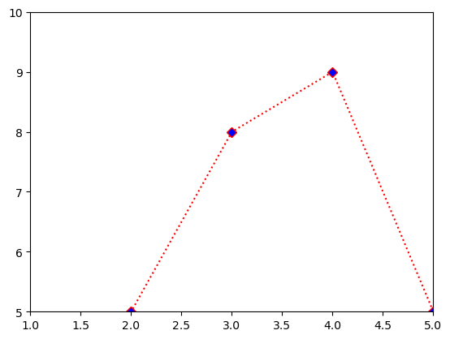

layout: single
title:  "bmi실습"
categories: MachineLearning
toc: true

### 1. 목표
- 500명의 키와 몸무게, 비만도 라벨을 이용해 비만은 판단하는 모델을 만들어보자


```python
import numpy as np
import pandas as pd
import matplotlib.pyplot as plt
```

##### csv 파일 가져오기 - bmi


```python
bmi = pd.read_csv("bmi_500.csv", index_col="Label")
# index_col = "컬럼명" : 인덱스명을 맨앞에 순번으로 빼내는 방법
```


```python
bmi.info()
```

    <class 'pandas.core.frame.DataFrame'>
    Index: 500 entries, Obesity to Extreme Obesity
    Data columns (total 3 columns):
     #   Column  Non-Null Count  Dtype 
    ---  ------  --------------  ----- 
     0   Gender  500 non-null    object
     1   Height  500 non-null    int64 
     2   Weight  500 non-null    int64 
    dtypes: int64(2), object(1)
    memory usage: 15.6+ KB
    


```python
# 기술통계 확인하는 방법
# std : 표준편차
# 25% : 몸무게를 예를 들면 몸무게가 낮은 순으로 25%

bmi.describe()
```


<div>
<style scoped>
    .dataframe tbody tr th:only-of-type {
        vertical-align: middle;
    }

    .dataframe tbody tr th {
        vertical-align: top;
    }

    .dataframe thead th {
        text-align: right;
    }
</style>
<table border="1" class="dataframe">
  <thead>
    <tr style="text-align: right;">
      <th></th>
      <th>Height</th>
      <th>Weight</th>
    </tr>
  </thead>
  <tbody>
    <tr>
      <th>count</th>
      <td>500.000000</td>
      <td>500.000000</td>
    </tr>
    <tr>
      <th>mean</th>
      <td>169.944000</td>
      <td>106.000000</td>
    </tr>
    <tr>
      <th>std</th>
      <td>16.375261</td>
      <td>32.382607</td>
    </tr>
    <tr>
      <th>min</th>
      <td>140.000000</td>
      <td>50.000000</td>
    </tr>
    <tr>
      <th>25%</th>
      <td>156.000000</td>
      <td>80.000000</td>
    </tr>
    <tr>
      <th>50%</th>
      <td>170.500000</td>
      <td>106.000000</td>
    </tr>
    <tr>
      <th>75%</th>
      <td>184.000000</td>
      <td>136.000000</td>
    </tr>
    <tr>
      <th>max</th>
      <td>199.000000</td>
      <td>160.000000</td>
    </tr>
  </tbody>
</table>
</div>


```python
# unique() : 유일한 값 찾기() -> 데이터에 고유값들이 어떠한 종류가 있는지 확인
bmi.index.unique()
```


    Index(['Obesity', 'Normal', 'Overweight', 'Extreme Obesity', 'Weak',
           'Extremely Weak'],
          dtype='object', name='Label')


```python
# Label의 값이 Normal인 사람만 뽑아오기

bmi_normal = bmi.loc["Normal"]
bmi_normal
```


<div>
<style scoped>
    .dataframe tbody tr th:only-of-type {
        vertical-align: middle;
    }

    .dataframe tbody tr th {
        vertical-align: top;
    }

    .dataframe thead th {
        text-align: right;
    }
</style>
<table border="1" class="dataframe">
  <thead>
    <tr style="text-align: right;">
      <th></th>
      <th>Gender</th>
      <th>Height</th>
      <th>Weight</th>
    </tr>
    <tr>
      <th>Label</th>
      <th></th>
      <th></th>
      <th></th>
    </tr>
  </thead>
  <tbody>
    <tr>
      <th>Normal</th>
      <td>Male</td>
      <td>189</td>
      <td>87</td>
    </tr>
    <tr>
      <th>Normal</th>
      <td>Male</td>
      <td>195</td>
      <td>81</td>
    </tr>
    <tr>
      <th>Normal</th>
      <td>Male</td>
      <td>155</td>
      <td>51</td>
    </tr>
    <tr>
      <th>Normal</th>
      <td>Male</td>
      <td>191</td>
      <td>79</td>
    </tr>
    <tr>
      <th>Normal</th>
      <td>Female</td>
      <td>172</td>
      <td>67</td>
    </tr>
    <tr>
      <th>...</th>
      <td>...</td>
      <td>...</td>
      <td>...</td>
    </tr>
    <tr>
      <th>Normal</th>
      <td>Female</td>
      <td>178</td>
      <td>65</td>
    </tr>
    <tr>
      <th>Normal</th>
      <td>Male</td>
      <td>167</td>
      <td>64</td>
    </tr>
    <tr>
      <th>Normal</th>
      <td>Female</td>
      <td>151</td>
      <td>55</td>
    </tr>
    <tr>
      <th>Normal</th>
      <td>Male</td>
      <td>187</td>
      <td>80</td>
    </tr>
    <tr>
      <th>Normal</th>
      <td>Female</td>
      <td>164</td>
      <td>59</td>
    </tr>
  </tbody>
</table>
<p>69 rows × 3 columns</p>
</div>


```python
# "Normal"인 사람의 "Height"

bmi_normal.loc[:,["Height","Weight"]]
```


<div>
<style scoped>
    .dataframe tbody tr th:only-of-type {
        vertical-align: middle;
    }

    .dataframe tbody tr th {
        vertical-align: top;
    }

    .dataframe thead th {
        text-align: right;
    }
</style>
<table border="1" class="dataframe">
  <thead>
    <tr style="text-align: right;">
      <th></th>
      <th>Height</th>
      <th>Weight</th>
    </tr>
    <tr>
      <th>Label</th>
      <th></th>
      <th></th>
    </tr>
  </thead>
  <tbody>
    <tr>
      <th>Normal</th>
      <td>189</td>
      <td>87</td>
    </tr>
    <tr>
      <th>Normal</th>
      <td>195</td>
      <td>81</td>
    </tr>
    <tr>
      <th>Normal</th>
      <td>155</td>
      <td>51</td>
    </tr>
    <tr>
      <th>Normal</th>
      <td>191</td>
      <td>79</td>
    </tr>
    <tr>
      <th>Normal</th>
      <td>172</td>
      <td>67</td>
    </tr>
    <tr>
      <th>...</th>
      <td>...</td>
      <td>...</td>
    </tr>
    <tr>
      <th>Normal</th>
      <td>178</td>
      <td>65</td>
    </tr>
    <tr>
      <th>Normal</th>
      <td>167</td>
      <td>64</td>
    </tr>
    <tr>
      <th>Normal</th>
      <td>151</td>
      <td>55</td>
    </tr>
    <tr>
      <th>Normal</th>
      <td>187</td>
      <td>80</td>
    </tr>
    <tr>
      <th>Normal</th>
      <td>164</td>
      <td>59</td>
    </tr>
  </tbody>
</table>
<p>69 rows × 2 columns</p>
</div>


```python
# 시각화 함수 만들기

def myScatter(label, color):
    tmp = bmi.loc[label]
    plt.scatter(tmp["Weight"],
               tmp["Height"],
                c=color,
                label=label)
```


```python
bmi.index.unique()
```


    Index(['Obesity', 'Normal', 'Overweight', 'Extreme Obesity', 'Weak',
           'Extremely Weak'],
          dtype='object', name='Label')


```python
myScatter("Extreme Obesity","red")
myScatter("Obesity","orange")
myScatter("Overweight","pink")
myScatter("Normal","green")
myScatter("Weak","blue")
myScatter("Extremely Weak","black")

plt.legend(loc=4)
plt.xlabel("Weight")
plt.ylabel("Height")
plt.show()

# 데이터들이 무리를 이루고 있고, 전체 500명중 4~5명의 데이터가 무리를 벗어나
# 다른 무리에 섞여있지만, 바로 분류 학습을 진행해도 괜찮을 것 같다!!
```


    

    


### 모델링
1. 문제(X)와 정답(y)으로 분리 // y=f(X)
2. 훈련데이터(train):평가데이터(test)=7:3로 분리
3. Model 선택,생성 및 Hyper Parameter 조정
4. 학습 및 평가


```python
# 인덱스를 컬럼으로 변경

bmi.reset_index(inplace=True)
```


```python
del bmi["level_0"]
```


    ---------------------------------------------------------------------------

    KeyError                                  Traceback (most recent call last)

    File ~\anaconda3\lib\site-packages\pandas\core\indexes\base.py:3621, in Index.get_loc(self, key, method, tolerance)
       3620 try:
    -> 3621     return self._engine.get_loc(casted_key)
       3622 except KeyError as err:
    

    File ~\anaconda3\lib\site-packages\pandas\_libs\index.pyx:136, in pandas._libs.index.IndexEngine.get_loc()
    

    File ~\anaconda3\lib\site-packages\pandas\_libs\index.pyx:163, in pandas._libs.index.IndexEngine.get_loc()
    

    File pandas\_libs\hashtable_class_helper.pxi:5198, in pandas._libs.hashtable.PyObjectHashTable.get_item()
    

    File pandas\_libs\hashtable_class_helper.pxi:5206, in pandas._libs.hashtable.PyObjectHashTable.get_item()
    

    KeyError: 'level_0'

    
    The above exception was the direct cause of the following exception:
    

    KeyError                                  Traceback (most recent call last)

    Input In [24], in <cell line: 1>()
    ----> 1 del bmi["level_0"]
    

    File ~\anaconda3\lib\site-packages\pandas\core\generic.py:4048, in NDFrame.__delitem__(self, key)
       4043             deleted = True
       4044 if not deleted:
       4045     # If the above loop ran and didn't delete anything because
       4046     # there was no match, this call should raise the appropriate
       4047     # exception:
    -> 4048     loc = self.axes[-1].get_loc(key)
       4049     self._mgr = self._mgr.idelete(loc)
       4051 # delete from the caches
    

    File ~\anaconda3\lib\site-packages\pandas\core\indexes\base.py:3623, in Index.get_loc(self, key, method, tolerance)
       3621     return self._engine.get_loc(casted_key)
       3622 except KeyError as err:
    -> 3623     raise KeyError(key) from err
       3624 except TypeError:
       3625     # If we have a listlike key, _check_indexing_error will raise
       3626     #  InvalidIndexError. Otherwise we fall through and re-raise
       3627     #  the TypeError.
       3628     self._check_indexing_error(key)
    

    KeyError: 'level_0'


```python
bmi.tail()
```


```python
# 문제(키,몸무게)
X=bmi.loc[:,"Height":"Weight"]
# bmi[["Height","Weight"]]

# 정답(Label)
y=bmi.loc[:,"Label"]
# bmi["Label"]
```


```python
# 2.훈련데이터(train):평가데이터(test)=7:3로 분리 (=350:150)

X_train=X.iloc[:350]
X_test=X.iloc[350:]
y_train=y.iloc[:350]
y_test=y.iloc[350:]
```


```python
# 3. 모델 생셩

from sklearn.neighbors import KNeighborsClassifier
```


```python
knn_model = KNeighborsClassifier()
```


```python
# 4-1. 학습

knn_model.fit(X_train,y_train)
```


```python
# 4-2. 평가

pre = knn_model.predict(X_test)
```


```python
y_test
```


```python
from sklearn import metrics
```


```python
metrics.accuracy_score(pre,y_test)
```


```python
# 3-2 Hyper Parameter 조정
# n_neighbors=10 : 기본5에서 10으로 수정

knn_model2 = KNeighborsClassifier(n_neighbors=10)
```


```python
# 모델 학습

knn_model2.fit(X_train,y_train)
```


```python
# 예측

pre = knn_model2.predict(X_test)
```


```python
# 평가

metrics.accuracy_score(pre,y_test)
```

#####  활용하기!!


```python
X_train.head(2)
```


```python
knn_model2.predict([[165,52],[152,62],[175,72]])
```
