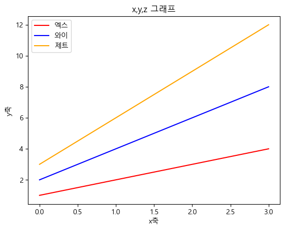
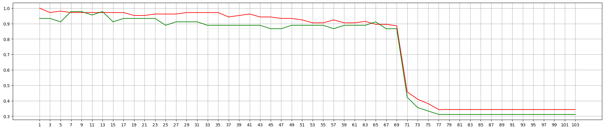

### 목표
- iris 꽃의 특징을 활용하여 품종을 (분류)하는 모델을 만들어보자!!
- KNN 모델을 사용하고, 하이퍼파라미터를 조정해보자!!(하이퍼파라미터 튜닝)


```python
import pandas as pd
import numpy as np
import matplotlib.pyplot as plt

# sklearn에서 제공하는 학습용 데이터

from sklearn.datasets import load_iris
```


```python
iris_data = load_iris()
```


```python
iris_data
```


    {'data': array([[5.1, 3.5, 1.4, 0.2],
            [4.9, 3. , 1.4, 0.2],
            [4.7, 3.2, 1.3, 0.2],
            [4.6, 3.1, 1.5, 0.2],
            [5. , 3.6, 1.4, 0.2],
            [5.4, 3.9, 1.7, 0.4],
            [4.6, 3.4, 1.4, 0.3],
            [5. , 3.4, 1.5, 0.2],
            [4.4, 2.9, 1.4, 0.2],
            [4.9, 3.1, 1.5, 0.1],
            [5.4, 3.7, 1.5, 0.2],
            [4.8, 3.4, 1.6, 0.2],
            [4.8, 3. , 1.4, 0.1],
            [4.3, 3. , 1.1, 0.1],
            [5.8, 4. , 1.2, 0.2],
            [5.7, 4.4, 1.5, 0.4],
            [5.4, 3.9, 1.3, 0.4],
            [5.1, 3.5, 1.4, 0.3],
            [5.7, 3.8, 1.7, 0.3],
            [5.1, 3.8, 1.5, 0.3],
            [5.4, 3.4, 1.7, 0.2],
            [5.1, 3.7, 1.5, 0.4],
            [4.6, 3.6, 1. , 0.2],
            [5.1, 3.3, 1.7, 0.5],
            [4.8, 3.4, 1.9, 0.2],
            [5. , 3. , 1.6, 0.2],
            [5. , 3.4, 1.6, 0.4],
            [5.2, 3.5, 1.5, 0.2],
            [5.2, 3.4, 1.4, 0.2],
            [4.7, 3.2, 1.6, 0.2],
            [4.8, 3.1, 1.6, 0.2],
            [5.4, 3.4, 1.5, 0.4],
            [5.2, 4.1, 1.5, 0.1],
            [5.5, 4.2, 1.4, 0.2],
            [4.9, 3.1, 1.5, 0.2],
            [5. , 3.2, 1.2, 0.2],
            [5.5, 3.5, 1.3, 0.2],
            [4.9, 3.6, 1.4, 0.1],
            [4.4, 3. , 1.3, 0.2],
            [5.1, 3.4, 1.5, 0.2],
            [5. , 3.5, 1.3, 0.3],
            [4.5, 2.3, 1.3, 0.3],
            [4.4, 3.2, 1.3, 0.2],
            [5. , 3.5, 1.6, 0.6],
            [5.1, 3.8, 1.9, 0.4],
            [4.8, 3. , 1.4, 0.3],
            [5.1, 3.8, 1.6, 0.2],
            [4.6, 3.2, 1.4, 0.2],
            [5.3, 3.7, 1.5, 0.2],
            [5. , 3.3, 1.4, 0.2],
            [7. , 3.2, 4.7, 1.4],
            [6.4, 3.2, 4.5, 1.5],
            [6.9, 3.1, 4.9, 1.5],
            [5.5, 2.3, 4. , 1.3],
            [6.5, 2.8, 4.6, 1.5],
            [5.7, 2.8, 4.5, 1.3],
            [6.3, 3.3, 4.7, 1.6],
            [4.9, 2.4, 3.3, 1. ],
            [6.6, 2.9, 4.6, 1.3],
            [5.2, 2.7, 3.9, 1.4],
            [5. , 2. , 3.5, 1. ],
            [5.9, 3. , 4.2, 1.5],
            [6. , 2.2, 4. , 1. ],
            [6.1, 2.9, 4.7, 1.4],
            [5.6, 2.9, 3.6, 1.3],
            [6.7, 3.1, 4.4, 1.4],
            [5.6, 3. , 4.5, 1.5],
            [5.8, 2.7, 4.1, 1. ],
            [6.2, 2.2, 4.5, 1.5],
            [5.6, 2.5, 3.9, 1.1],
            [5.9, 3.2, 4.8, 1.8],
            [6.1, 2.8, 4. , 1.3],
            [6.3, 2.5, 4.9, 1.5],
            [6.1, 2.8, 4.7, 1.2],
            [6.4, 2.9, 4.3, 1.3],
            [6.6, 3. , 4.4, 1.4],
            [6.8, 2.8, 4.8, 1.4],
            [6.7, 3. , 5. , 1.7],
            [6. , 2.9, 4.5, 1.5],
            [5.7, 2.6, 3.5, 1. ],
            [5.5, 2.4, 3.8, 1.1],
            [5.5, 2.4, 3.7, 1. ],
            [5.8, 2.7, 3.9, 1.2],
            [6. , 2.7, 5.1, 1.6],
            [5.4, 3. , 4.5, 1.5],
            [6. , 3.4, 4.5, 1.6],
            [6.7, 3.1, 4.7, 1.5],
            [6.3, 2.3, 4.4, 1.3],
            [5.6, 3. , 4.1, 1.3],
            [5.5, 2.5, 4. , 1.3],
            [5.5, 2.6, 4.4, 1.2],
            [6.1, 3. , 4.6, 1.4],
            [5.8, 2.6, 4. , 1.2],
            [5. , 2.3, 3.3, 1. ],
            [5.6, 2.7, 4.2, 1.3],
            [5.7, 3. , 4.2, 1.2],
            [5.7, 2.9, 4.2, 1.3],
            [6.2, 2.9, 4.3, 1.3],
            [5.1, 2.5, 3. , 1.1],
            [5.7, 2.8, 4.1, 1.3],
            [6.3, 3.3, 6. , 2.5],
            [5.8, 2.7, 5.1, 1.9],
            [7.1, 3. , 5.9, 2.1],
            [6.3, 2.9, 5.6, 1.8],
            [6.5, 3. , 5.8, 2.2],
            [7.6, 3. , 6.6, 2.1],
            [4.9, 2.5, 4.5, 1.7],
            [7.3, 2.9, 6.3, 1.8],
            [6.7, 2.5, 5.8, 1.8],
            [7.2, 3.6, 6.1, 2.5],
            [6.5, 3.2, 5.1, 2. ],
            [6.4, 2.7, 5.3, 1.9],
            [6.8, 3. , 5.5, 2.1],
            [5.7, 2.5, 5. , 2. ],
            [5.8, 2.8, 5.1, 2.4],
            [6.4, 3.2, 5.3, 2.3],
            [6.5, 3. , 5.5, 1.8],
            [7.7, 3.8, 6.7, 2.2],
            [7.7, 2.6, 6.9, 2.3],
            [6. , 2.2, 5. , 1.5],
            [6.9, 3.2, 5.7, 2.3],
            [5.6, 2.8, 4.9, 2. ],
            [7.7, 2.8, 6.7, 2. ],
            [6.3, 2.7, 4.9, 1.8],
            [6.7, 3.3, 5.7, 2.1],
            [7.2, 3.2, 6. , 1.8],
            [6.2, 2.8, 4.8, 1.8],
            [6.1, 3. , 4.9, 1.8],
            [6.4, 2.8, 5.6, 2.1],
            [7.2, 3. , 5.8, 1.6],
            [7.4, 2.8, 6.1, 1.9],
            [7.9, 3.8, 6.4, 2. ],
            [6.4, 2.8, 5.6, 2.2],
            [6.3, 2.8, 5.1, 1.5],
            [6.1, 2.6, 5.6, 1.4],
            [7.7, 3. , 6.1, 2.3],
            [6.3, 3.4, 5.6, 2.4],
            [6.4, 3.1, 5.5, 1.8],
            [6. , 3. , 4.8, 1.8],
            [6.9, 3.1, 5.4, 2.1],
            [6.7, 3.1, 5.6, 2.4],
            [6.9, 3.1, 5.1, 2.3],
            [5.8, 2.7, 5.1, 1.9],
            [6.8, 3.2, 5.9, 2.3],
            [6.7, 3.3, 5.7, 2.5],
            [6.7, 3. , 5.2, 2.3],
            [6.3, 2.5, 5. , 1.9],
            [6.5, 3. , 5.2, 2. ],
            [6.2, 3.4, 5.4, 2.3],
            [5.9, 3. , 5.1, 1.8]]),
     'target': array([0, 0, 0, 0, 0, 0, 0, 0, 0, 0, 0, 0, 0, 0, 0, 0, 0, 0, 0, 0, 0, 0,
            0, 0, 0, 0, 0, 0, 0, 0, 0, 0, 0, 0, 0, 0, 0, 0, 0, 0, 0, 0, 0, 0,
            0, 0, 0, 0, 0, 0, 1, 1, 1, 1, 1, 1, 1, 1, 1, 1, 1, 1, 1, 1, 1, 1,
            1, 1, 1, 1, 1, 1, 1, 1, 1, 1, 1, 1, 1, 1, 1, 1, 1, 1, 1, 1, 1, 1,
            1, 1, 1, 1, 1, 1, 1, 1, 1, 1, 1, 1, 2, 2, 2, 2, 2, 2, 2, 2, 2, 2,
            2, 2, 2, 2, 2, 2, 2, 2, 2, 2, 2, 2, 2, 2, 2, 2, 2, 2, 2, 2, 2, 2,
            2, 2, 2, 2, 2, 2, 2, 2, 2, 2, 2, 2, 2, 2, 2, 2, 2, 2]),
     'frame': None,
     'target_names': array(['setosa', 'versicolor', 'virginica'], dtype='<U10'),
     'DESCR': '.. _iris_dataset:\n\nIris plants dataset\n--------------------\n\n**Data Set Characteristics:**\n\n    :Number of Instances: 150 (50 in each of three classes)\n    :Number of Attributes: 4 numeric, predictive attributes and the class\n    :Attribute Information:\n        - sepal length in cm\n        - sepal width in cm\n        - petal length in cm\n        - petal width in cm\n        - class:\n                - Iris-Setosa\n                - Iris-Versicolour\n                - Iris-Virginica\n                \n    :Summary Statistics:\n\n    ============== ==== ==== ======= ===== ====================\n                    Min  Max   Mean    SD   Class Correlation\n    ============== ==== ==== ======= ===== ====================\n    sepal length:   4.3  7.9   5.84   0.83    0.7826\n    sepal width:    2.0  4.4   3.05   0.43   -0.4194\n    petal length:   1.0  6.9   3.76   1.76    0.9490  (high!)\n    petal width:    0.1  2.5   1.20   0.76    0.9565  (high!)\n    ============== ==== ==== ======= ===== ====================\n\n    :Missing Attribute Values: None\n    :Class Distribution: 33.3% for each of 3 classes.\n    :Creator: R.A. Fisher\n    :Donor: Michael Marshall (MARSHALL%PLU@io.arc.nasa.gov)\n    :Date: July, 1988\n\nThe famous Iris database, first used by Sir R.A. Fisher. The dataset is taken\nfrom Fisher\'s paper. Note that it\'s the same as in R, but not as in the UCI\nMachine Learning Repository, which has two wrong data points.\n\nThis is perhaps the best known database to be found in the\npattern recognition literature.  Fisher\'s paper is a classic in the field and\nis referenced frequently to this day.  (See Duda & Hart, for example.)  The\ndata set contains 3 classes of 50 instances each, where each class refers to a\ntype of iris plant.  One class is linearly separable from the other 2; the\nlatter are NOT linearly separable from each other.\n\n.. topic:: References\n\n   - Fisher, R.A. "The use of multiple measurements in taxonomic problems"\n     Annual Eugenics, 7, Part II, 179-188 (1936); also in "Contributions to\n     Mathematical Statistics" (John Wiley, NY, 1950).\n   - Duda, R.O., & Hart, P.E. (1973) Pattern Classification and Scene Analysis.\n     (Q327.D83) John Wiley & Sons.  ISBN 0-471-22361-1.  See page 218.\n   - Dasarathy, B.V. (1980) "Nosing Around the Neighborhood: A New System\n     Structure and Classification Rule for Recognition in Partially Exposed\n     Environments".  IEEE Transactions on Pattern Analysis and Machine\n     Intelligence, Vol. PAMI-2, No. 1, 67-71.\n   - Gates, G.W. (1972) "The Reduced Nearest Neighbor Rule".  IEEE Transactions\n     on Information Theory, May 1972, 431-433.\n   - See also: 1988 MLC Proceedings, 54-64.  Cheeseman et al"s AUTOCLASS II\n     conceptual clustering system finds 3 classes in the data.\n   - Many, many more ...',
     'feature_names': ['sepal length (cm)',
      'sepal width (cm)',
      'petal length (cm)',
      'petal width (cm)'],
     'filename': 'iris.csv',
     'data_module': 'sklearn.datasets.data'}


```python
iris_data.keys()
```


    dict_keys(['data', 'target', 'frame', 'target_names', 'DESCR', 'feature_names', 'filename', 'data_module'])


```python
# 특성(문제) 데이터
# 꽃의 측정 데이터(꽃잎, 꽃받침

iris_data.data
```


    array([[5.1, 3.5, 1.4, 0.2],
           [4.9, 3. , 1.4, 0.2],
           [4.7, 3.2, 1.3, 0.2],
           [4.6, 3.1, 1.5, 0.2],
           [5. , 3.6, 1.4, 0.2],
           [5.4, 3.9, 1.7, 0.4],
           [4.6, 3.4, 1.4, 0.3],
           [5. , 3.4, 1.5, 0.2],
           [4.4, 2.9, 1.4, 0.2],
           [4.9, 3.1, 1.5, 0.1],
           [5.4, 3.7, 1.5, 0.2],
           [4.8, 3.4, 1.6, 0.2],
           [4.8, 3. , 1.4, 0.1],
           [4.3, 3. , 1.1, 0.1],
           [5.8, 4. , 1.2, 0.2],
           [5.7, 4.4, 1.5, 0.4],
           [5.4, 3.9, 1.3, 0.4],
           [5.1, 3.5, 1.4, 0.3],
           [5.7, 3.8, 1.7, 0.3],
           [5.1, 3.8, 1.5, 0.3],
           [5.4, 3.4, 1.7, 0.2],
           [5.1, 3.7, 1.5, 0.4],
           [4.6, 3.6, 1. , 0.2],
           [5.1, 3.3, 1.7, 0.5],
           [4.8, 3.4, 1.9, 0.2],
           [5. , 3. , 1.6, 0.2],
           [5. , 3.4, 1.6, 0.4],
           [5.2, 3.5, 1.5, 0.2],
           [5.2, 3.4, 1.4, 0.2],
           [4.7, 3.2, 1.6, 0.2],
           [4.8, 3.1, 1.6, 0.2],
           [5.4, 3.4, 1.5, 0.4],
           [5.2, 4.1, 1.5, 0.1],
           [5.5, 4.2, 1.4, 0.2],
           [4.9, 3.1, 1.5, 0.2],
           [5. , 3.2, 1.2, 0.2],
           [5.5, 3.5, 1.3, 0.2],
           [4.9, 3.6, 1.4, 0.1],
           [4.4, 3. , 1.3, 0.2],
           [5.1, 3.4, 1.5, 0.2],
           [5. , 3.5, 1.3, 0.3],
           [4.5, 2.3, 1.3, 0.3],
           [4.4, 3.2, 1.3, 0.2],
           [5. , 3.5, 1.6, 0.6],
           [5.1, 3.8, 1.9, 0.4],
           [4.8, 3. , 1.4, 0.3],
           [5.1, 3.8, 1.6, 0.2],
           [4.6, 3.2, 1.4, 0.2],
           [5.3, 3.7, 1.5, 0.2],
           [5. , 3.3, 1.4, 0.2],
           [7. , 3.2, 4.7, 1.4],
           [6.4, 3.2, 4.5, 1.5],
           [6.9, 3.1, 4.9, 1.5],
           [5.5, 2.3, 4. , 1.3],
           [6.5, 2.8, 4.6, 1.5],
           [5.7, 2.8, 4.5, 1.3],
           [6.3, 3.3, 4.7, 1.6],
           [4.9, 2.4, 3.3, 1. ],
           [6.6, 2.9, 4.6, 1.3],
           [5.2, 2.7, 3.9, 1.4],
           [5. , 2. , 3.5, 1. ],
           [5.9, 3. , 4.2, 1.5],
           [6. , 2.2, 4. , 1. ],
           [6.1, 2.9, 4.7, 1.4],
           [5.6, 2.9, 3.6, 1.3],
           [6.7, 3.1, 4.4, 1.4],
           [5.6, 3. , 4.5, 1.5],
           [5.8, 2.7, 4.1, 1. ],
           [6.2, 2.2, 4.5, 1.5],
           [5.6, 2.5, 3.9, 1.1],
           [5.9, 3.2, 4.8, 1.8],
           [6.1, 2.8, 4. , 1.3],
           [6.3, 2.5, 4.9, 1.5],
           [6.1, 2.8, 4.7, 1.2],
           [6.4, 2.9, 4.3, 1.3],
           [6.6, 3. , 4.4, 1.4],
           [6.8, 2.8, 4.8, 1.4],
           [6.7, 3. , 5. , 1.7],
           [6. , 2.9, 4.5, 1.5],
           [5.7, 2.6, 3.5, 1. ],
           [5.5, 2.4, 3.8, 1.1],
           [5.5, 2.4, 3.7, 1. ],
           [5.8, 2.7, 3.9, 1.2],
           [6. , 2.7, 5.1, 1.6],
           [5.4, 3. , 4.5, 1.5],
           [6. , 3.4, 4.5, 1.6],
           [6.7, 3.1, 4.7, 1.5],
           [6.3, 2.3, 4.4, 1.3],
           [5.6, 3. , 4.1, 1.3],
           [5.5, 2.5, 4. , 1.3],
           [5.5, 2.6, 4.4, 1.2],
           [6.1, 3. , 4.6, 1.4],
           [5.8, 2.6, 4. , 1.2],
           [5. , 2.3, 3.3, 1. ],
           [5.6, 2.7, 4.2, 1.3],
           [5.7, 3. , 4.2, 1.2],
           [5.7, 2.9, 4.2, 1.3],
           [6.2, 2.9, 4.3, 1.3],
           [5.1, 2.5, 3. , 1.1],
           [5.7, 2.8, 4.1, 1.3],
           [6.3, 3.3, 6. , 2.5],
           [5.8, 2.7, 5.1, 1.9],
           [7.1, 3. , 5.9, 2.1],
           [6.3, 2.9, 5.6, 1.8],
           [6.5, 3. , 5.8, 2.2],
           [7.6, 3. , 6.6, 2.1],
           [4.9, 2.5, 4.5, 1.7],
           [7.3, 2.9, 6.3, 1.8],
           [6.7, 2.5, 5.8, 1.8],
           [7.2, 3.6, 6.1, 2.5],
           [6.5, 3.2, 5.1, 2. ],
           [6.4, 2.7, 5.3, 1.9],
           [6.8, 3. , 5.5, 2.1],
           [5.7, 2.5, 5. , 2. ],
           [5.8, 2.8, 5.1, 2.4],
           [6.4, 3.2, 5.3, 2.3],
           [6.5, 3. , 5.5, 1.8],
           [7.7, 3.8, 6.7, 2.2],
           [7.7, 2.6, 6.9, 2.3],
           [6. , 2.2, 5. , 1.5],
           [6.9, 3.2, 5.7, 2.3],
           [5.6, 2.8, 4.9, 2. ],
           [7.7, 2.8, 6.7, 2. ],
           [6.3, 2.7, 4.9, 1.8],
           [6.7, 3.3, 5.7, 2.1],
           [7.2, 3.2, 6. , 1.8],
           [6.2, 2.8, 4.8, 1.8],
           [6.1, 3. , 4.9, 1.8],
           [6.4, 2.8, 5.6, 2.1],
           [7.2, 3. , 5.8, 1.6],
           [7.4, 2.8, 6.1, 1.9],
           [7.9, 3.8, 6.4, 2. ],
           [6.4, 2.8, 5.6, 2.2],
           [6.3, 2.8, 5.1, 1.5],
           [6.1, 2.6, 5.6, 1.4],
           [7.7, 3. , 6.1, 2.3],
           [6.3, 3.4, 5.6, 2.4],
           [6.4, 3.1, 5.5, 1.8],
           [6. , 3. , 4.8, 1.8],
           [6.9, 3.1, 5.4, 2.1],
           [6.7, 3.1, 5.6, 2.4],
           [6.9, 3.1, 5.1, 2.3],
           [5.8, 2.7, 5.1, 1.9],
           [6.8, 3.2, 5.9, 2.3],
           [6.7, 3.3, 5.7, 2.5],
           [6.7, 3. , 5.2, 2.3],
           [6.3, 2.5, 5. , 1.9],
           [6.5, 3. , 5.2, 2. ],
           [6.2, 3.4, 5.4, 2.3],
           [5.9, 3. , 5.1, 1.8]])


```python
# 레이블 값 // 꽃의 품종 정보
# 클래스는 0, 1, 2로 3개

iris_data.target
```


    array([0, 0, 0, 0, 0, 0, 0, 0, 0, 0, 0, 0, 0, 0, 0, 0, 0, 0, 0, 0, 0, 0,
           0, 0, 0, 0, 0, 0, 0, 0, 0, 0, 0, 0, 0, 0, 0, 0, 0, 0, 0, 0, 0, 0,
           0, 0, 0, 0, 0, 0, 1, 1, 1, 1, 1, 1, 1, 1, 1, 1, 1, 1, 1, 1, 1, 1,
           1, 1, 1, 1, 1, 1, 1, 1, 1, 1, 1, 1, 1, 1, 1, 1, 1, 1, 1, 1, 1, 1,
           1, 1, 1, 1, 1, 1, 1, 1, 1, 1, 1, 1, 2, 2, 2, 2, 2, 2, 2, 2, 2, 2,
           2, 2, 2, 2, 2, 2, 2, 2, 2, 2, 2, 2, 2, 2, 2, 2, 2, 2, 2, 2, 2, 2,
           2, 2, 2, 2, 2, 2, 2, 2, 2, 2, 2, 2, 2, 2, 2, 2, 2, 2])


```python
# 꽃 품종 이름

iris_data.target_names
```


    array(['setosa', 'versicolor', 'virginica'], dtype='<U10')


```python
# 꽃 특징 이름(특성 정보)

iris_data.feature_names
```


    ['sepal length (cm)',
     'sepal width (cm)',
     'petal length (cm)',
     'petal width (cm)']


```python
print(iris_data.DESCR)
```

    .. _iris_dataset:
    
    Iris plants dataset
    --------------------
    
    **Data Set Characteristics:**
    
        :Number of Instances: 150 (50 in each of three classes)
        :Number of Attributes: 4 numeric, predictive attributes and the class
        :Attribute Information:
            - sepal length in cm
            - sepal width in cm
            - petal length in cm
            - petal width in cm
            - class:
                    - Iris-Setosa
                    - Iris-Versicolour
                    - Iris-Virginica
                    
        :Summary Statistics:
    
        ============== ==== ==== ======= ===== ====================
                        Min  Max   Mean    SD   Class Correlation
        ============== ==== ==== ======= ===== ====================
        sepal length:   4.3  7.9   5.84   0.83    0.7826
        sepal width:    2.0  4.4   3.05   0.43   -0.4194
        petal length:   1.0  6.9   3.76   1.76    0.9490  (high!)
        petal width:    0.1  2.5   1.20   0.76    0.9565  (high!)
        ============== ==== ==== ======= ===== ====================
    
        :Missing Attribute Values: None
        :Class Distribution: 33.3% for each of 3 classes.
        :Creator: R.A. Fisher
        :Donor: Michael Marshall (MARSHALL%PLU@io.arc.nasa.gov)
        :Date: July, 1988
    
    The famous Iris database, first used by Sir R.A. Fisher. The dataset is taken
    from Fisher's paper. Note that it's the same as in R, but not as in the UCI
    Machine Learning Repository, which has two wrong data points.
    
    This is perhaps the best known database to be found in the
    pattern recognition literature.  Fisher's paper is a classic in the field and
    is referenced frequently to this day.  (See Duda & Hart, for example.)  The
    data set contains 3 classes of 50 instances each, where each class refers to a
    type of iris plant.  One class is linearly separable from the other 2; the
    latter are NOT linearly separable from each other.
    
    .. topic:: References
    
       - Fisher, R.A. "The use of multiple measurements in taxonomic problems"
         Annual Eugenics, 7, Part II, 179-188 (1936); also in "Contributions to
         Mathematical Statistics" (John Wiley, NY, 1950).
       - Duda, R.O., & Hart, P.E. (1973) Pattern Classification and Scene Analysis.
         (Q327.D83) John Wiley & Sons.  ISBN 0-471-22361-1.  See page 218.
       - Dasarathy, B.V. (1980) "Nosing Around the Neighborhood: A New System
         Structure and Classification Rule for Recognition in Partially Exposed
         Environments".  IEEE Transactions on Pattern Analysis and Machine
         Intelligence, Vol. PAMI-2, No. 1, 67-71.
       - Gates, G.W. (1972) "The Reduced Nearest Neighbor Rule".  IEEE Transactions
         on Information Theory, May 1972, 431-433.
       - See also: 1988 MLC Proceedings, 54-64.  Cheeseman et al"s AUTOCLASS II
         conceptual clustering system finds 3 classes in the data.
       - Many, many more ...
    

### 1. 문제정의
- iris 꽃을 분류해보자
- 지도학습(값이 정확하게 들어있음) / 분류학습(Classification)

### 2. 데이터 수집
- sklearn 내장 데이터 활용(bunch, 딕셔너와 유사)

### 3. 데이터 전처리
- 결측치 여부 확인 및 처리
- 데이터 단위 확인


```python
# 데이터프레임에 데이터 넣고, 컬럼명 수정

iris_df = pd.DataFrame(data=iris_data.data, columns=iris_data.feature_names)
iris_df
```


<div>
<style scoped>
    .dataframe tbody tr th:only-of-type {
        vertical-align: middle;
    }

    .dataframe tbody tr th {
        vertical-align: top;
    }

    .dataframe thead th {
        text-align: right;
    }
</style>
<table border="1" class="dataframe">
  <thead>
    <tr style="text-align: right;">
      <th></th>
      <th>sepal length (cm)</th>
      <th>sepal width (cm)</th>
      <th>petal length (cm)</th>
      <th>petal width (cm)</th>
    </tr>
  </thead>
  <tbody>
    <tr>
      <th>0</th>
      <td>5.1</td>
      <td>3.5</td>
      <td>1.4</td>
      <td>0.2</td>
    </tr>
    <tr>
      <th>1</th>
      <td>4.9</td>
      <td>3.0</td>
      <td>1.4</td>
      <td>0.2</td>
    </tr>
    <tr>
      <th>2</th>
      <td>4.7</td>
      <td>3.2</td>
      <td>1.3</td>
      <td>0.2</td>
    </tr>
    <tr>
      <th>3</th>
      <td>4.6</td>
      <td>3.1</td>
      <td>1.5</td>
      <td>0.2</td>
    </tr>
    <tr>
      <th>4</th>
      <td>5.0</td>
      <td>3.6</td>
      <td>1.4</td>
      <td>0.2</td>
    </tr>
    <tr>
      <th>...</th>
      <td>...</td>
      <td>...</td>
      <td>...</td>
      <td>...</td>
    </tr>
    <tr>
      <th>145</th>
      <td>6.7</td>
      <td>3.0</td>
      <td>5.2</td>
      <td>2.3</td>
    </tr>
    <tr>
      <th>146</th>
      <td>6.3</td>
      <td>2.5</td>
      <td>5.0</td>
      <td>1.9</td>
    </tr>
    <tr>
      <th>147</th>
      <td>6.5</td>
      <td>3.0</td>
      <td>5.2</td>
      <td>2.0</td>
    </tr>
    <tr>
      <th>148</th>
      <td>6.2</td>
      <td>3.4</td>
      <td>5.4</td>
      <td>2.3</td>
    </tr>
    <tr>
      <th>149</th>
      <td>5.9</td>
      <td>3.0</td>
      <td>5.1</td>
      <td>1.8</td>
    </tr>
  </tbody>
</table>
<p>150 rows × 4 columns</p>
</div>


```python
# 결측치 확인

iris_df.info()
```

    <class 'pandas.core.frame.DataFrame'>
    RangeIndex: 150 entries, 0 to 149
    Data columns (total 4 columns):
     #   Column             Non-Null Count  Dtype  
    ---  ------             --------------  -----  
     0   sepal length (cm)  150 non-null    float64
     1   sepal width (cm)   150 non-null    float64
     2   petal length (cm)  150 non-null    float64
     3   petal width (cm)   150 non-null    float64
    dtypes: float64(4)
    memory usage: 4.8 KB
    

### 4. 탐색적 데이터 분석(EDA)
- 산점도 그래프 그리기!
- pandas 라이브러리 활용


```python
# 시각화
# scatter : 산점도
# scatter_matrix : 산점도 배열
# 투명도 : alpha
# 색 입히기 : .target

pd.plotting.scatter_matrix(iris_df,figsize=(10,10), 
                           marker="o", c=iris_data.target,
                          alpha=0.7)
plt.show()
```


    

    


```python
# 3품종(클래스)가 꽃잎과 꽃받침의 정보에 따라 비교적 잘 구분된다!!
```

### 5. 모델선택


```python
from sklearn.neighbors import KNeighborsClassifier
```


```python
# 모델 생성

model = KNeighborsClassifier()
```

### 6. 모델 학습
- 학습 데이터와 데스트 데이터로 분리 (7:3)


```python
# 7:3 = 105:45

X_train=iris_df.iloc[:105]
X_test=iris_df.iloc[105:]
y_train=iris_data.target[:105]
y_test=iris_data.target[105:]
```


```python
from sklearn.model_selection import train_test_split
```


```python
# random_state : 데이터를 뽑고 랜덤으로 출력
# 호출시마다 무작위로 섞어서 비율에 따라 train, test를 나눔!!
# default 값 = 75:25
# test_size =0.3 : test비율. 나머지 0.7을 train으로 사용

X_train, X_test, y_train, y_test = train_test_split(iris_data.data,
                                                   iris_data.target,
                                                    train_size=0.7,
                                                   random_state=65)
```


```python
X_train.shape, y_train.shape
```


    ((105, 4), (105,))


```python
X_test.shape, y_test.shape
```


    ((45, 4), (45,))


```python
# 모델 학습

model.fit(X_train,y_train)
```


<style>#sk-container-id-3 {color: black;background-color: white;}#sk-container-id-3 pre{padding: 0;}#sk-container-id-3 div.sk-toggleable {background-color: white;}#sk-container-id-3 label.sk-toggleable__label {cursor: pointer;display: block;width: 100%;margin-bottom: 0;padding: 0.3em;box-sizing: border-box;text-align: center;}#sk-container-id-3 label.sk-toggleable__label-arrow:before {content: "▸";float: left;margin-right: 0.25em;color: #696969;}#sk-container-id-3 label.sk-toggleable__label-arrow:hover:before {color: black;}#sk-container-id-3 div.sk-estimator:hover label.sk-toggleable__label-arrow:before {color: black;}#sk-container-id-3 div.sk-toggleable__content {max-height: 0;max-width: 0;overflow: hidden;text-align: left;background-color: #f0f8ff;}#sk-container-id-3 div.sk-toggleable__content pre {margin: 0.2em;color: black;border-radius: 0.25em;background-color: #f0f8ff;}#sk-container-id-3 input.sk-toggleable__control:checked~div.sk-toggleable__content {max-height: 200px;max-width: 100%;overflow: auto;}#sk-container-id-3 input.sk-toggleable__control:checked~label.sk-toggleable__label-arrow:before {content: "▾";}#sk-container-id-3 div.sk-estimator input.sk-toggleable__control:checked~label.sk-toggleable__label {background-color: #d4ebff;}#sk-container-id-3 div.sk-label input.sk-toggleable__control:checked~label.sk-toggleable__label {background-color: #d4ebff;}#sk-container-id-3 input.sk-hidden--visually {border: 0;clip: rect(1px 1px 1px 1px);clip: rect(1px, 1px, 1px, 1px);height: 1px;margin: -1px;overflow: hidden;padding: 0;position: absolute;width: 1px;}#sk-container-id-3 div.sk-estimator {font-family: monospace;background-color: #f0f8ff;border: 1px dotted black;border-radius: 0.25em;box-sizing: border-box;margin-bottom: 0.5em;}#sk-container-id-3 div.sk-estimator:hover {background-color: #d4ebff;}#sk-container-id-3 div.sk-parallel-item::after {content: "";width: 100%;border-bottom: 1px solid gray;flex-grow: 1;}#sk-container-id-3 div.sk-label:hover label.sk-toggleable__label {background-color: #d4ebff;}#sk-container-id-3 div.sk-serial::before {content: "";position: absolute;border-left: 1px solid gray;box-sizing: border-box;top: 0;bottom: 0;left: 50%;z-index: 0;}#sk-container-id-3 div.sk-serial {display: flex;flex-direction: column;align-items: center;background-color: white;padding-right: 0.2em;padding-left: 0.2em;position: relative;}#sk-container-id-3 div.sk-item {position: relative;z-index: 1;}#sk-container-id-3 div.sk-parallel {display: flex;align-items: stretch;justify-content: center;background-color: white;position: relative;}#sk-container-id-3 div.sk-item::before, #sk-container-id-3 div.sk-parallel-item::before {content: "";position: absolute;border-left: 1px solid gray;box-sizing: border-box;top: 0;bottom: 0;left: 50%;z-index: -1;}#sk-container-id-3 div.sk-parallel-item {display: flex;flex-direction: column;z-index: 1;position: relative;background-color: white;}#sk-container-id-3 div.sk-parallel-item:first-child::after {align-self: flex-end;width: 50%;}#sk-container-id-3 div.sk-parallel-item:last-child::after {align-self: flex-start;width: 50%;}#sk-container-id-3 div.sk-parallel-item:only-child::after {width: 0;}#sk-container-id-3 div.sk-dashed-wrapped {border: 1px dashed gray;margin: 0 0.4em 0.5em 0.4em;box-sizing: border-box;padding-bottom: 0.4em;background-color: white;}#sk-container-id-3 div.sk-label label {font-family: monospace;font-weight: bold;display: inline-block;line-height: 1.2em;}#sk-container-id-3 div.sk-label-container {text-align: center;}#sk-container-id-3 div.sk-container {/* jupyter's `normalize.less` sets `[hidden] { display: none; }` but bootstrap.min.css set `[hidden] { display: none !important; }` so we also need the `!important` here to be able to override the default hidden behavior on the sphinx rendered scikit-learn.org. See: https://github.com/scikit-learn/scikit-learn/issues/21755 */display: inline-block !important;position: relative;}#sk-container-id-3 div.sk-text-repr-fallback {display: none;}</style><div id="sk-container-id-3" class="sk-top-container"><div class="sk-text-repr-fallback"><pre>KNeighborsClassifier()</pre><b>In a Jupyter environment, please rerun this cell to show the HTML representation or trust the notebook. <br />On GitHub, the HTML representation is unable to render, please try loading this page with nbviewer.org.</b></div><div class="sk-container" hidden><div class="sk-item"><div class="sk-estimator sk-toggleable"><input class="sk-toggleable__control sk-hidden--visually" id="sk-estimator-id-3" type="checkbox" checked><label for="sk-estimator-id-3" class="sk-toggleable__label sk-toggleable__label-arrow">KNeighborsClassifier</label><div class="sk-toggleable__content"><pre>KNeighborsClassifier()</pre></div></div></div></div></div>


### 7. 모델 평가


```python
# 모델이 학습한 것을 바탕으로 예측한 값

pre = model.predict(X_test)
pre
```


    array([2, 2, 0, 1, 0, 2, 0, 0, 2, 1, 0, 1, 2, 0, 0, 0, 1, 1, 2, 2, 2, 2,
           2, 2, 0, 2, 0, 2, 1, 0, 1, 2, 0, 1, 1, 1, 2, 0, 2, 2, 0, 0, 1, 1,
           0])


```python
y_test
```


    array([2, 1, 0, 1, 0, 2, 0, 0, 2, 1, 0, 1, 1, 0, 0, 0, 1, 2, 2, 1, 2, 2,
           2, 2, 0, 2, 0, 2, 1, 0, 1, 2, 0, 1, 1, 1, 2, 0, 2, 2, 0, 0, 1, 1,
           0])


```python
from sklearn import metrics
```


```python
metrics.accuracy_score(pre,y_test)
```


    0.9111111111111111


```python
from sklearn.metrics import classification_report
```


```python
print(classification_report(pre,y_test))
```

                  precision    recall  f1-score   support
    
               0       1.00      1.00      1.00        16
               1       0.79      0.92      0.85        12
               2       0.93      0.82      0.87        17
    
        accuracy                           0.91        45
       macro avg       0.91      0.91      0.91        45
    weighted avg       0.92      0.91      0.91        45
    
    

### 하이퍼파라미터 튜닝(최적의 이웃의 수 찾기)


```python
train_list=[]
test_list=[]

# 이웃의 수(K)에 따른 모델 생성(복잡한 모델(=과대적합 모델) -> 단순한 모델)

for k in range(1,105,2):
    model=KNeighborsClassifier(n_neighbors=k)
    model.fit(X_train, y_train)
    
    train_score = model.score(X_train, y_train)
    train_list.append(train_score)
    
    test_score = model.score(X_test, y_test)
    test_list.append(test_score)
```


```python
plt.figure(figsize=(25,5))
plt.plot(range(1,105,2),train_list, c="red")
plt.plot(range(1,105,2),test_list, c="green")
plt.xticks(range(1,105,2)) # x축 범위 조절 
plt.grid() # 눈금 넣기
plt.show()

# 초반(k=1,3, ... , 69) 복잡한 모델링
# 높은 점수에서 점차 낮아지고 있음
# 낮아지다가 어느 지점에서 성능이 매우 낮아짐
# k = 7 ~ 13의 이웃이 최적의 지점!!!
```


    

    


#### 모델 선정 및 활용


```python
final_model = KNeighborsClassifier(n_neighbors=11)
final_model.fit(X_train, y_train)
```


<style>#sk-container-id-4 {color: black;background-color: white;}#sk-container-id-4 pre{padding: 0;}#sk-container-id-4 div.sk-toggleable {background-color: white;}#sk-container-id-4 label.sk-toggleable__label {cursor: pointer;display: block;width: 100%;margin-bottom: 0;padding: 0.3em;box-sizing: border-box;text-align: center;}#sk-container-id-4 label.sk-toggleable__label-arrow:before {content: "▸";float: left;margin-right: 0.25em;color: #696969;}#sk-container-id-4 label.sk-toggleable__label-arrow:hover:before {color: black;}#sk-container-id-4 div.sk-estimator:hover label.sk-toggleable__label-arrow:before {color: black;}#sk-container-id-4 div.sk-toggleable__content {max-height: 0;max-width: 0;overflow: hidden;text-align: left;background-color: #f0f8ff;}#sk-container-id-4 div.sk-toggleable__content pre {margin: 0.2em;color: black;border-radius: 0.25em;background-color: #f0f8ff;}#sk-container-id-4 input.sk-toggleable__control:checked~div.sk-toggleable__content {max-height: 200px;max-width: 100%;overflow: auto;}#sk-container-id-4 input.sk-toggleable__control:checked~label.sk-toggleable__label-arrow:before {content: "▾";}#sk-container-id-4 div.sk-estimator input.sk-toggleable__control:checked~label.sk-toggleable__label {background-color: #d4ebff;}#sk-container-id-4 div.sk-label input.sk-toggleable__control:checked~label.sk-toggleable__label {background-color: #d4ebff;}#sk-container-id-4 input.sk-hidden--visually {border: 0;clip: rect(1px 1px 1px 1px);clip: rect(1px, 1px, 1px, 1px);height: 1px;margin: -1px;overflow: hidden;padding: 0;position: absolute;width: 1px;}#sk-container-id-4 div.sk-estimator {font-family: monospace;background-color: #f0f8ff;border: 1px dotted black;border-radius: 0.25em;box-sizing: border-box;margin-bottom: 0.5em;}#sk-container-id-4 div.sk-estimator:hover {background-color: #d4ebff;}#sk-container-id-4 div.sk-parallel-item::after {content: "";width: 100%;border-bottom: 1px solid gray;flex-grow: 1;}#sk-container-id-4 div.sk-label:hover label.sk-toggleable__label {background-color: #d4ebff;}#sk-container-id-4 div.sk-serial::before {content: "";position: absolute;border-left: 1px solid gray;box-sizing: border-box;top: 0;bottom: 0;left: 50%;z-index: 0;}#sk-container-id-4 div.sk-serial {display: flex;flex-direction: column;align-items: center;background-color: white;padding-right: 0.2em;padding-left: 0.2em;position: relative;}#sk-container-id-4 div.sk-item {position: relative;z-index: 1;}#sk-container-id-4 div.sk-parallel {display: flex;align-items: stretch;justify-content: center;background-color: white;position: relative;}#sk-container-id-4 div.sk-item::before, #sk-container-id-4 div.sk-parallel-item::before {content: "";position: absolute;border-left: 1px solid gray;box-sizing: border-box;top: 0;bottom: 0;left: 50%;z-index: -1;}#sk-container-id-4 div.sk-parallel-item {display: flex;flex-direction: column;z-index: 1;position: relative;background-color: white;}#sk-container-id-4 div.sk-parallel-item:first-child::after {align-self: flex-end;width: 50%;}#sk-container-id-4 div.sk-parallel-item:last-child::after {align-self: flex-start;width: 50%;}#sk-container-id-4 div.sk-parallel-item:only-child::after {width: 0;}#sk-container-id-4 div.sk-dashed-wrapped {border: 1px dashed gray;margin: 0 0.4em 0.5em 0.4em;box-sizing: border-box;padding-bottom: 0.4em;background-color: white;}#sk-container-id-4 div.sk-label label {font-family: monospace;font-weight: bold;display: inline-block;line-height: 1.2em;}#sk-container-id-4 div.sk-label-container {text-align: center;}#sk-container-id-4 div.sk-container {/* jupyter's `normalize.less` sets `[hidden] { display: none; }` but bootstrap.min.css set `[hidden] { display: none !important; }` so we also need the `!important` here to be able to override the default hidden behavior on the sphinx rendered scikit-learn.org. See: https://github.com/scikit-learn/scikit-learn/issues/21755 */display: inline-block !important;position: relative;}#sk-container-id-4 div.sk-text-repr-fallback {display: none;}</style><div id="sk-container-id-4" class="sk-top-container"><div class="sk-text-repr-fallback"><pre>KNeighborsClassifier(n_neighbors=11)</pre><b>In a Jupyter environment, please rerun this cell to show the HTML representation or trust the notebook. <br />On GitHub, the HTML representation is unable to render, please try loading this page with nbviewer.org.</b></div><div class="sk-container" hidden><div class="sk-item"><div class="sk-estimator sk-toggleable"><input class="sk-toggleable__control sk-hidden--visually" id="sk-estimator-id-4" type="checkbox" checked><label for="sk-estimator-id-4" class="sk-toggleable__label sk-toggleable__label-arrow">KNeighborsClassifier</label><div class="sk-toggleable__content"><pre>KNeighborsClassifier(n_neighbors=11)</pre></div></div></div></div></div>


```python
final_model.score(X_test,y_test)
```


    0.9555555555555556


```python
pred = final_model.predict([[6.5, 3.8, 3.5, 1.6]])
pred
```


    array([1])


```python
X_train
```


    array([[6.4, 2.8, 5.6, 2.2],
           [7.2, 3. , 5.8, 1.6],
           [6. , 2.7, 5.1, 1.6],
           [5.1, 3.8, 1.5, 0.3],
           [5.2, 3.5, 1.5, 0.2],
           [5.5, 2.6, 4.4, 1.2],
           [5.7, 2.9, 4.2, 1.3],
           [5. , 3. , 1.6, 0.2],
           [7.3, 2.9, 6.3, 1.8],
           [5.6, 2.5, 3.9, 1.1],
           [6.7, 3.1, 4.4, 1.4],
           [6. , 2.9, 4.5, 1.5],
           [5.5, 2.5, 4. , 1.3],
           [6.3, 2.7, 4.9, 1.8],
           [5. , 3.3, 1.4, 0.2],
           [7.7, 2.6, 6.9, 2.3],
           [5.8, 4. , 1.2, 0.2],
           [7.2, 3.6, 6.1, 2.5],
           [4.5, 2.3, 1.3, 0.3],
           [6.6, 2.9, 4.6, 1.3],
           [5.8, 2.8, 5.1, 2.4],
           [5.8, 2.7, 5.1, 1.9],
           [5.6, 3. , 4.1, 1.3],
           [5.9, 3.2, 4.8, 1.8],
           [4.3, 3. , 1.1, 0.1],
           [4.4, 3.2, 1.3, 0.2],
           [6.3, 3.3, 4.7, 1.6],
           [4.6, 3.2, 1.4, 0.2],
           [6.7, 3.3, 5.7, 2.1],
           [6. , 2.2, 5. , 1.5],
           [4.9, 2.4, 3.3, 1. ],
           [5. , 3.2, 1.2, 0.2],
           [5. , 3.4, 1.5, 0.2],
           [5.9, 3. , 4.2, 1.5],
           [5.1, 3.5, 1.4, 0.2],
           [6.5, 3. , 5.2, 2. ],
           [4.7, 3.2, 1.3, 0.2],
           [5.8, 2.7, 3.9, 1.2],
           [6.4, 3.2, 4.5, 1.5],
           [5.5, 2.4, 3.7, 1. ],
           [7. , 3.2, 4.7, 1.4],
           [6.2, 3.4, 5.4, 2.3],
           [6.3, 3.4, 5.6, 2.4],
           [6.6, 3. , 4.4, 1.4],
           [5.7, 2.5, 5. , 2. ],
           [6.5, 3. , 5.5, 1.8],
           [5.4, 3.9, 1.7, 0.4],
           [6.8, 3. , 5.5, 2.1],
           [5.4, 3.9, 1.3, 0.4],
           [4.8, 3.4, 1.6, 0.2],
           [6. , 3.4, 4.5, 1.6],
           [6.8, 2.8, 4.8, 1.4],
           [6.1, 2.8, 4.7, 1.2],
           [5. , 3.6, 1.4, 0.2],
           [6.7, 2.5, 5.8, 1.8],
           [6.3, 3.3, 6. , 2.5],
           [5.7, 2.6, 3.5, 1. ],
           [4.8, 3. , 1.4, 0.3],
           [4.9, 2.5, 4.5, 1.7],
           [5.5, 2.4, 3.8, 1.1],
           [6.9, 3.1, 5.4, 2.1],
           [5.4, 3. , 4.5, 1.5],
           [5.9, 3. , 5.1, 1.8],
           [5. , 2. , 3.5, 1. ],
           [5.2, 4.1, 1.5, 0.1],
           [5.7, 3.8, 1.7, 0.3],
           [5.1, 3.3, 1.7, 0.5],
           [6.3, 2.5, 5. , 1.9],
           [5.5, 2.3, 4. , 1.3],
           [5.5, 3.5, 1.3, 0.2],
           [5.6, 3. , 4.5, 1.5],
           [6.7, 3. , 5.2, 2.3],
           [6.7, 3.1, 5.6, 2.4],
           [4.4, 3. , 1.3, 0.2],
           [5.1, 3.8, 1.9, 0.4],
           [6.4, 3.2, 5.3, 2.3],
           [4.6, 3.6, 1. , 0.2],
           [6.1, 3. , 4.6, 1.4],
           [5.7, 3. , 4.2, 1.2],
           [5.3, 3.7, 1.5, 0.2],
           [5.6, 2.7, 4.2, 1.3],
           [5.8, 2.7, 5.1, 1.9],
           [6.7, 3.1, 4.7, 1.5],
           [4.7, 3.2, 1.6, 0.2],
           [7.4, 2.8, 6.1, 1.9],
           [4.8, 3.1, 1.6, 0.2],
           [5.7, 4.4, 1.5, 0.4],
           [7.9, 3.8, 6.4, 2. ],
           [5.1, 2.5, 3. , 1.1],
           [5.6, 2.9, 3.6, 1.3],
           [6. , 3. , 4.8, 1.8],
           [6.1, 2.6, 5.6, 1.4],
           [5. , 3.4, 1.6, 0.4],
           [6.4, 3.1, 5.5, 1.8],
           [6.9, 3.2, 5.7, 2.3],
           [6.2, 2.9, 4.3, 1.3],
           [6.5, 3. , 5.8, 2.2],
           [4.9, 3. , 1.4, 0.2],
           [7.1, 3. , 5.9, 2.1],
           [4.6, 3.4, 1.4, 0.3],
           [6.1, 2.8, 4. , 1.3],
           [5. , 3.5, 1.3, 0.3],
           [6.1, 2.9, 4.7, 1.4],
           [7.7, 3.8, 6.7, 2.2],
           [5.1, 3.8, 1.6, 0.2]])


```python
iris_data["target_names"][pred]
```


    array(['versicolor'], dtype='<U10')


```python
iris_data["target_names"]
```


    array(['setosa', 'versicolor', 'virginica'], dtype='<U10')


