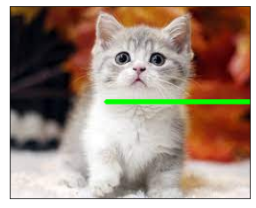

```python
!pip install pytesseract
```

    Requirement already satisfied: pytesseract in c:\users\smhrd\anaconda3\lib\site-packages (0.3.10)
    Requirement already satisfied: Pillow>=8.0.0 in c:\users\smhrd\anaconda3\lib\site-packages (from pytesseract) (9.0.1)
    Requirement already satisfied: packaging>=21.3 in c:\users\smhrd\anaconda3\lib\site-packages (from pytesseract) (21.3)
    Requirement already satisfied: pyparsing!=3.0.5,>=2.0.2 in c:\users\smhrd\anaconda3\lib\site-packages (from packaging>=21.3->pytesseract) (3.0.4)
    


```python
import cv2
import matplotlib.pyplot as plt
import pytesseract
```


```python
pytesseract.pytesseract.tesseract_cmd=r"D:\Tesseract-OCR\tesseract.exe"

# r : 뒤에 오는 문자열을 그대로 기억
```


```python
img = cv2.imread("text.png")
img = cv2.cvtColor(img,cv2.COLOR_RGB2BGR)

plt.xticks([])
plt.yticks([])
plt.imshow(img)
```


    <matplotlib.image.AxesImage at 0x21e4b8d8b50>


    

    


```python
# eng : 영어
text = pytesseract.image_to_string(img,lang="eng")
print(text)
```

    Life is a journey,
    not a guided tour.
    
    - Anonymous -
    
    


```python
img = cv2.imread("story.png")
img = cv2.cvtColor(img,cv2.COLOR_RGB2BGR)

plt.xticks([])
plt.yticks([])
plt.imshow(img)
```


    <matplotlib.image.AxesImage at 0x21e4c97d130>


    

    


```python
# eng : 영어
text2 = pytesseract.image_to_string(img,lang="kor")
print(text2)
```

    소년
    
    여기저기서 단풍잎 같은 슬픈 가을이 뚝뚝 떨어진다. 단풍잎
    떨어져 나온 자리마다 봄을 마련해 놓고 나못가지 위에 하늘이
    펼쳐 있다. 가만히 하늘을 들여다보려면 눈썸에 파란 물감이
    든다. 두 손으로 따뜻한 볼을 쓸어 보면 손바닥에도 파란 물감
    이 묻어난다. 다시 손바닥을 들여다본다. 손금에는 맑은 강물
    이 흐르고, 맑은 강물이 흐르고, 강물 속에는 사랑처럼 슬픈 얼
    굴ㅡ- 아름다운 순이의 얼굴이 어린다. 소년은 황홀히 눈을
    감아 본다. 그래도 맑은 강물은 흘러 사랑처럼 슬픈 얼굴--
    아름다운 순이의 얼굴은 어린다.
    
    


```python
img = cv2.imread("nature.png")
img = cv2.cvtColor(img,cv2.COLOR_RGB2BGR)

plt.xticks([])
plt.yticks([])
plt.imshow(img)
```


    <matplotlib.image.AxesImage at 0x21e4c9b7e50>


    

    


```python
text3 = pytesseract.image_to_string(img,lang="kor")
print(text3)
```

    자연을 대출하면
    미래는 파산합니다
    
    
    


```python
img = cv2.imread("text01.png")
img = cv2.cvtColor(img,cv2.COLOR_RGB2BGR)

plt.xticks([])
plt.yticks([])
plt.imshow(img)
```


    <matplotlib.image.AxesImage at 0x21e4cc345b0>


    

    


```python
text4 = pytesseract.image_to_string(img,lang="eng")
print(text4)
```

    1 Oa GIFT OF
    ONESELF.
    
    Jean Anouilh
    
    


```python
img = cv2.imread("text01.png")
img = cv2.cvtColor(img,cv2.COLOR_RGB2BGR)
# 이미지 전처리를 해주면 인식율이 높아질 수 있다.
# 흑백 이미지화
img = cv2.cvtColor(img, cv2.COLOR_BGR2GRAY)
_, img = cv2.threshold(img, 150, 255, cv2.THRESH_BINARY)

plt.xticks([])
plt.yticks([])
plt.imshow(img, cmap="gray")
```


    <matplotlib.image.AxesImage at 0x21e4cd563a0>


    

    


```python
text5 = pytesseract.image_to_string(img,lang="eng")
print(text5)
```

    LOVE IS, ABOVE ALL
    ELSE, THE GIFT OF
    ONESELF.
    
    Jean Anouilh
    
    


```python
img = cv2.imread("car.png")
img = cv2.cvtColor(img,cv2.COLOR_BGR2RGB)
img = cv2.cvtColor(img,cv2.COLOR_BGR2GRAY)

plt.xticks([])
plt.yticks([])
plt.imshow(img, cmap="gray")
```


    <matplotlib.image.AxesImage at 0x21e4d184d60>


    

    


```python
text6 = pytesseract.image_to_string(img,lang="kor")
print(text6)
```

    527 3108.
    
    


```python
# 흑백 -> 이진화
img = cv2.imread("car.png")
img = cv2.cvtColor(img,cv2.COLOR_BGR2RGB)
img = cv2.cvtColor(img,cv2.COLOR_BGR2GRAY)
_,img = cv2.threshold(img,150,250,0)

plt.xticks([])
plt.yticks([])
plt.imshow(img, cmap="gray")
```


    <matplotlib.image.AxesImage at 0x21e47eaeee0>


    

    


```python
text7 = pytesseract.image_to_string(img,lang="kor")
print(text7)
```

    | 52가 3108
    
    
