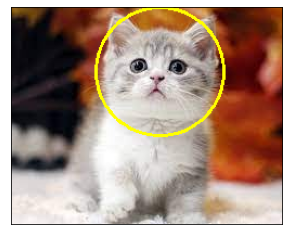
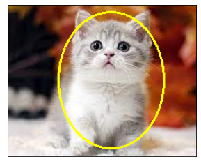

        
○ ROI (Region of Image)를 자르고 표시하는 방법에 대해 학습한다.<br>
○ 한글을 출력하는 방법에 대해 학습한다.<br>
○ 비트 연산으로 이미지를 합성하는 방법을 학습한다.


# 픽셀/블록 기반 이미지 처리

## ROI (Region of Image) 자르기

- ROI (Region of Image) 
   - 관심영역 - 이미지에 우리가 필요한 부분 (얼굴, 눈 ...)
   


- <font color=red>img[200:370, 200:350]</font>


```python
import cv2
import matplotlib.pyplot as plt
```


```python
# 이미지 띄우기
img = cv2.imread("cats.jpg")
img = cv2.cvtColor(img, cv2.COLOR_BGR2RGB)

plt.xticks([])
plt.yticks([])
plt.imshow(img)
```


    <matplotlib.image.AxesImage at 0x2cd74f603d0>


    

    


```python
img = cv2.imread("cats.jpg")
img = cv2.cvtColor(img, cv2.COLOR_BGR2RGB)

# 저장해준 이미지를 슬라이싱
subimg = img[10:120, 50:200]

plt.xticks([])
plt.yticks([])
plt.imshow(subimg)
```


    <matplotlib.image.AxesImage at 0x2cd7c58bbb0>


    

    


## ROI에 도형 그리기

- <font color=red>cv2.line(배경이미지, 시작점좌표, 끝점좌표, 색상, 선두께)</font> : 직선 그리기


```python
img = cv2.imread("cats.jpg")
img = cv2.cvtColor(img, cv2.COLOR_BGR2RGB)
# 색상은 RGB
img = cv2.line(img,(100,100),(480,100),(0,255,0),3)

plt.xticks([])
plt.yticks([])
plt.imshow(img)
```


    <matplotlib.image.AxesImage at 0x2cd7c663b80>


    

    


- <font color=red>cv2.circle(배경이미지, 중심좌표, 반지름, 색상, 선두께)</font> : 원 그리기


```python
img = cv2.imread("cats.jpg")
img = cv2.cvtColor(img, cv2.COLOR_BGR2RGB)
# 색상은 RGB
# 선 두께 = -1 : 색이 채워진 원
img = cv2.circle(img,(137,60),59,(255,255,0),2)

plt.xticks([])
plt.yticks([])
plt.imshow(img)
```


    <matplotlib.image.AxesImage at 0x2cd7f429ee0>


    

    


- <font color=red>cv2.rectangle(배경이미지, 좌상단점좌표, 우하단점좌표, 색상, 선두께)</font> : 사각형 그리기


```python
img = cv2.imread("cats.jpg")
img = cv2.cvtColor(img, cv2.COLOR_BGR2RGB)
# 색상은 RGB
img = cv2.rectangle(img,(78,5),(196,110),(255,255,0),2)

plt.xticks([])
plt.yticks([])
plt.imshow(img)
```


    <matplotlib.image.AxesImage at 0x2cd7f3ed970>


    

    


- <font color=red>cv2.ellipse(배경이미지, 중심좌표, 장축/단축 반지름, 기울기, 호의시작각, 호의 종료각, 색상, 선두께)</font> : 타원 그리기


```python
img = cv2.imread("cats.jpg")
img = cv2.cvtColor(img, cv2.COLOR_BGR2RGB)
# 색상은 RGB
img = cv2.ellipse(img,(137,100),(70,90),0,0,360,(255,255,0),2)

plt.xticks([])
plt.yticks([])
plt.imshow(img)
```


    <matplotlib.image.AxesImage at 0x2cd7f677820>


    

    


- <font color=red>cv2.putText(배경이미지, 출력내용, 출력시작좌표, 폰트, 크기, 색상, 굵기)</font> : 텍스트 그리기


```python
img = cv2.imread("cats.jpg")
img = cv2.cvtColor(img, cv2.COLOR_BGR2RGB)
# 색상은 RGB
# 사용할 폰트 설정
font = cv2.FONT_HERSHEY_TRIPLEX
img = cv2.putText(img,"Cats",(103,120),font,1,(255,255,0),2)

plt.xticks([])
plt.yticks([])
plt.imshow(img)
```


    <matplotlib.image.AxesImage at 0x2cd7b0bcac0>


    

    


## 한글 출력하기

- c:/Windows/Fonts 폴더에서 사용할 폰트를 현재 폴더에 fonts 폴더를 생성하고 복사한다


- <font color=red>font = ImageFont.truetype("fonts/gulim.ttc", 30)</font> : 사용할 폰트와 크기를 가져온다

- <font color=red>img_pil = Image.fromarray(img)</font> : array 이미지를 PIL 이미지로 변환

- <font color=red>draw = ImageDraw.Draw(img_pil)</font> : PIL 이미지를 그림

- <font color=red>draw.text((200, 20), "레나 이미지", font=font, fill=(0, 0, 255, 0))</font> : 이미지에 텍스트를 그림

- <font color=red>img = np.array(img_pil)</font> : PIL 이미지를 numpy 배열로 변환


```python
from PIL import ImageFont, ImageDraw, Image
import numpy as np
```


```python
img = cv2.imread("cats.jpg")
img = cv2.cvtColor(img,cv2.COLOR_BGR2RGB)

font = ImageFont.truetype("fonts/gulim.ttc",30)
img_pil = Image.fromarray(img)
draw = ImageDraw.Draw(img_pil)
# fill =(F,G,B,alpah)
draw.text((103,120),"야옹이",font=font,fill=(255,255,0,2))

img = np.array(img_pil)

plt.xticks([])
plt.yticks([])
plt.imshow(img)
```


    <matplotlib.image.AxesImage at 0x2cd030ba1c0>


    

    


<table border=1 width=100%>
    <tr><td style="border: 1px solid black; width:600px; height:40px; text-align: center;"><font size=4 color=blue><b>[6차시] 정리하기</b></font></td></tr>       
    <tr><td style="border: 1px solid black; text-align: left;"><font size=2>
○ ROI (Region of Image) : 관심영역을 의미<br>
○ line() - 선그리기<br> 
○ circle() - 원 그리기<br> 
○ rectangle() - 사각형 그리기<br> 
○ ellipse() - 타원 그리기<br> 
○ putText() - 문자 출력<br>
        
</table>


```python

```
