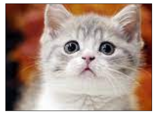

<table border=1 width=100%>
    <tr><td style="border: 1px solid black; width:600px; height:40px; text-align: center;"><font size=4 color=blue><b>[5차시] 학습목표</b></font></td></tr>       
    <tr><td style="border: 1px solid black; text-align: left;"><font size=3>
        
○ OpenCV를 활용한 이미지 처리 방법에 대해 학습한다.<br>
○ 칼라/흑백/이진 이미지의 픽셀값을 출력하고 픽셀값을 변경해본다.<br>
○ RGB 채널을 분리하고 병합해본다.
</font></td></tr>   
</table>

# 이미지 처리 기초

- 픽셀 기반 처리 : 이미지를 픽셀 단위로 처리하는 방법
  - 이미지의 특성으로 표현하는 데 한계가 있음, 이미지 처리 속도가 느림
- 블록 기반 처리 : 이미지를 블록 (픽셀을 그룹화한 것)  단위로 처리하는 방법
  - 이미지의 지역적 특성을 잘 표현, 이미지 속도가  빠름  필터링
- 주파수 기반 처리 : 이미지를  주파수 영역으로 변환하여 처리하는 방법
  - 이미지의 전역적 특성으로 잘 표현 - FFT, DCT, WT 등
  
  
- 픽셀 (pixel : picture cell)
  - 이미지를 구성하는 최소 단위 
  - 0-255의 값으로 구성 (검정색 0, 흰색 255)
  
  
  
  
- 블럭 (block)
  - 근방의 픽셀을 그룹핑한 것  
  - 근방의 픽셀은 유사한 특성을 가진다는 것을 가정
  - 일반적으로 블럭간에 중복을 시켜서 처리 – 블럭간의 Locality반영
  
    
    
    
- 주파수 (frequency)
  -  주파수 (frequency) : 이미지 픽셀값들을 픽셀값의 변화분으로 변환한 것
  - 이미지에서 주파수 : 픽셀의 변화량
    - 고주파 성분 : 픽셀값의 변화가 큰 부분 (에지)
    - 저주파 성분 : 픽셀값의 변화가 작은 부분
  - 일반적인 이미지는 주로 저주파 성분으로 구성되어 있음
  - 이미지의 중요한 특성은 주로 고주파 성분에 존재

    

## 이미지 픽셀 값 출력

### 이진 이미지 픽셀 값 출력


```python
import cv2
import matplotlib.pyplot as plt
```


```python
#실습
img = cv2.imread("./lecture_image/checkerboard_18x18.png", cv2.IMREAD_GRAYSCALE)

plt.xticks([])
plt.yticks([])
plt.imshow(img, cmap="gray")
```


    <matplotlib.image.AxesImage at 0x23cbd436070>


    

    


- 이미지의 픽셀값은 0-255 사이 값으로 구성 (8bit 양의 정수 형태)
- 검정색은 0, 흰색은 255


```python
#실습
img = cv2.imread("./lecture_image/checkerboard_fuzzy_18x18.jpg", cv2.IMREAD_GRAYSCALE)

plt.xticks([])
plt.yticks([])
plt.imshow(img, cmap="gray")
```


    <matplotlib.image.AxesImage at 0x23cbd476160>


    

    


### 그레이 이미지 픽셀 값 출력


```python
#실습
```


```python
#실습
```

### 칼라 이미지 픽셀 값 출력

- 픽셀값 접근/변경
   -  픽셀값은 numpy 배열 형태로 접근하고 변경
     - img[200, 100] : 픽셀의 좌표
     - Red, Green, Blue 순으로 출력


```python
img = cv2.imread("./lecture_image/coca-cola-logo.png", cv2.IMREAD_COLOR)
img = cv2.cvtColor(img, cv2.COLOR_BGR2RGB)

plt.xticks([])
plt.yticks([])
plt.imshow(img)
```


    <matplotlib.image.AxesImage at 0x23cbe40d280>


    

    


```python
# 이미지 자체가 배열
px=img[200,100]
print(px)
```

    [199   4  21]
    

<table border=1 width=100%>
    <tr><td style="border: 1px solid black; width:600px; text-align: left;"><font size=4 color=red><b>실습문제</b></font><br><br>
        <font size=4>
○ 다른 이미지의 픽셀값을 출력해 보자.<br>
   </td></tr>   
</table>

## 픽셀값 변경


```python
img = cv2.imread("./lecture_image/coca-cola-logo.png", cv2.IMREAD_COLOR)
img = cv2.cvtColor(img, cv2.COLOR_BGR2RGB)

for x in range(200,210):
    for y in range(100,110):
        img[x,y]=[0,0,255] # 해당 위치의 픽셀을 파란색 [R,G,B]로 변경
        
plt.xticks([])
plt.yticks([])
plt.imshow(img)
```


    <matplotlib.image.AxesImage at 0x23cbe47f280>


    

    


<table border=1 width=100%>
    <tr><td style="border: 1px solid black; width:600px; text-align: left;"><font size=4 color=red><b>실습문제</b></font><br><br>
        <font size=4>
○ 다른 이미지의 픽셀값을 변경해 보자.<br>
   </td></tr>   
</table>

# RGB 채널 다루기

- 이미지 채널
     - 흑백은 1개의 채널 이미지로 구성되고, 칼라는 Red, Green, Blue 3개의 채널 이미지로 구성

    

## RGB 채널 분리하기

- <font color=red>변수 = img[:, :, 채널번호]</font>

  - img[:, :, 0] : red 채널
  - img[:, :, 1] : green 채널
  - img[:, :, 2] : blue 채널


```python
#실습
img = cv2.imread("./lecture_image/New_Zealand_Lake.jpg", cv2.IMREAD_COLOR)
img = cv2.cvtColor(img, cv2.COLOR_BGR2RGB)

plt.xticks([])
plt.yticks([])
plt.imshow(img)
```


    <matplotlib.image.AxesImage at 0x23cb9a27eb0>


    

    


```python
img = cv2.imread("./lecture_image/New_Zealand_Lake.jpg", cv2.IMREAD_COLOR)
img = cv2.cvtColor(img,cv2.COLOR_BGR2RGB)

# 채널별로 이미지 분리
r = img[:,:,0]
g = img[:,:,1]
b = img[:,:,2]

plt.figure(figsize=(10,5))
plt.subplot(1,3,1)
plt.xticks([])
plt.yticks([])
plt.title("red channel")
plt.imshow(r, cmap="gray")

plt.figure(figsize=(10,5))
plt.subplot(1,3,2)
plt.xticks([])
plt.yticks([])
plt.title("green channel")
plt.imshow(g, cmap="gray")

plt.figure(figsize=(10,5))
plt.subplot(1,3,3)
plt.xticks([])
plt.yticks([])
plt.title("blue channel")
plt.imshow(b, cmap="gray")
```


    <matplotlib.image.AxesImage at 0x23cbfbe2880>


    

    


    

    


    

    


- 흰색이 가까울수록 픽셀 수가 많다는 것을 의미

## RGB 채널 합치기

- cv2.merge((r, g, b) : RGB 각 채널을 합침


```python
img = cv2.merge((r,g,b))
plt.xticks([])
plt.yticks([])
plt.imshow(img)
```


    <matplotlib.image.AxesImage at 0x23cbfc6e5b0>


    

    


## 픽셀값을 RGB 채널 값을 이용해서 변경하기

- <font color=red>img.itemset((x, y, 0), 0)</font>
  - itemset((픽셀y위치, 픽셀x위치, 채널), 색상레벨)
  - 채널 (0 : Red, 1 : Green, 2 : Blue)  
  - 0번 채널의 (x, y) 픽셀의 값을 0으로 변경  


```python
img = cv2.imread("./lecture_image/coca-cola-logo.png", cv2.IMREAD_COLOR)
img = cv2.cvtColor(img, cv2.COLOR_BGR2RGB)

for x in range(200,210):
    for y in range(100,110):
        img.itemset((x,y,0),0)
    
plt.xticks([])
plt.yticks([])
plt.imshow(img)

# 파랑색으로 바꾼게 아니라 RED 채널의 색깔이 0으로 빠진 것
```


    <matplotlib.image.AxesImage at 0x23cbff3dd00>


    

    


<table border=1 width=100%>
    <tr><td style="border: 1px solid black; width:600px; text-align: left;"><font size=4 color=red><b>실습문제</b></font><br><br>
        <font size=4>
○ 다른 채널의 픽셀값을 변경해 보자.<br>
   </td></tr>   
</table>

# 이미지의 속성 출력

- img.shape : 이미지의 크기 및 채널 
- img.size : 이미지의 전체 픽셀 수
- img.dtype : 데이터 타입


```python
img = cv2.imread("./lecture_image/coca-cola-logo.png", cv2.IMREAD_COLOR)
img = cv2.cvtColor(img, cv2.COLOR_BGR2RGB)

print(img.shape)
print(img.size)
print(img.dtype)

# 넘파이 배열
```

    (700, 700, 3)
    1470000
    uint8
    

<table border=1 width=100%>
    <tr><td style="border: 1px solid black; width:600px; height:40px; text-align: center;"><font size=4 color=blue><b>[5차시] 학습요약</b></font></td></tr>       
    <tr><td style="border: 1px solid black; text-align: left;"><font size=3>
        
○ 이미지 처리 방법 : 픽셀기반, 블록기반, 주파수 기반 처리<br>
○ 이미지의 픽셀값은 0-255 사이 값으로 구성 (8bit 양의 정수 형태) - 검정색은 0, 흰색은 255<br>
○ 픽셀값은 3차원 배열 형태로 접근 ([x축, y축, 채널])<br>
○ <font color=red>itemset((x축, y축, 채널), 값)</font> : 해당 채널의 픽셀값을 변경<br><br>

○ <font color=red>img.shape</font> : 이미지 크기<br>
○ <font color=red>img.size</font> : 전체 픽셀 수<br>
○ <font color=red>img.dtype</font> : 데이터 타입
        
</font></td></tr>   
</table>
